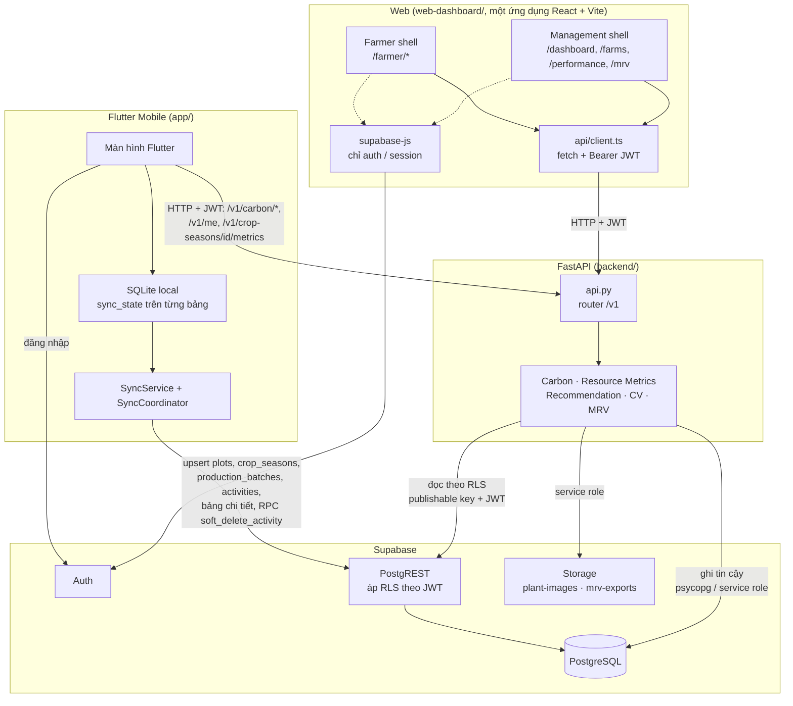
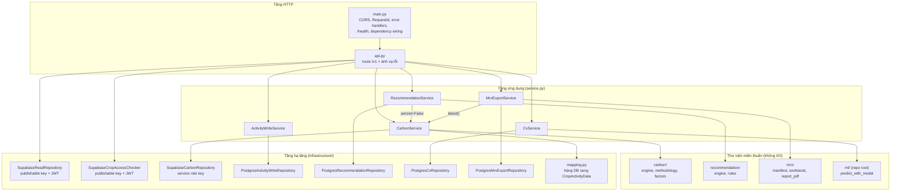

# Container architecture

Hai sơ đồ dưới đây tách **mức container** (ứng dụng ↔ dịch vụ) và **mức thành
phần bên trong FastAPI**, để không dồn mọi thứ vào một sơ đồ khó đọc.

## 1. Container

### Khác biệt quan trọng giữa các client

| Client | Ghi dữ liệu nghiệp vụ | Đọc dữ liệu nghiệp vụ | Supabase client dùng để làm gì |
|---|---|---|---|
| **Flutter** | **Trực tiếp** vào Supabase (PostgREST) dưới RLS, idempotent theo `(device_id, client_event_id)` | Farm/Plot/Season kéo từ Supabase về SQLite; Carbon, metrics, `/v1/me` qua FastAPI | Auth **và** đọc/ghi dữ liệu |
| **Farmer Web** | **Qua FastAPI**: `POST/PATCH/DELETE` activity, generate/accept khuyến nghị, upload ảnh CV | Qua FastAPI | **Chỉ** auth/session (`utils/supabase.ts`: "Auth only. Dashboard data is intentionally fetched through FastAPI.") |
| **Management Web** | Tính lại Carbon (`POST /v1/carbon/calculate`) và tạo gói xuất MRV — đều qua FastAPI | Qua FastAPI | **Chỉ** auth/session |

Không có endpoint `/v1/sync` trên FastAPI; Flutter đồng bộ thẳng vào Supabase.

## 2. Thành phần bên trong FastAPI

### Kênh truy cập dữ liệu của backend

| Kênh | Khoá / kết nối | Dùng cho | RLS |
|---|---|---|---|
| `SupabaseReadRepository` | `SUPABASE_PUBLISHABLE_KEY` + JWT người gọi (client cache theo đúng token, `supabase_clients.py`) | Mọi route `GET`, `/v1/me`, và bước kiểm tra phạm vi trước khi ghi | **Có** |
| `SupabaseCropAccessChecker` | Publishable key + JWT | Cổng quyền của `/v1/carbon/calculate` và `GET .../carbon` | **Có** |
| `SupabaseCarbonRepository` | `SUPABASE_SERVICE_ROLE_KEY` (supabase-py) | Đọc bundle dữ liệu vụ để tính, ghi `carbon_calculations`/`carbon_breakdowns`, đọc bản tính mới nhất | Bỏ qua — chỉ chạy **sau** cổng RLS |
| Repository psycopg (`write_repo`, `recommendation_repo`, `cv_repo`, `mrv_export_repo`) | `SUPABASE_DB_URL`, pool `psycopg_pool` (`pg_pool.py`) | Ghi activity (transaction base + chi tiết), khuyến nghị, CV, MRV export | Bỏ qua — chỉ chạy **sau** cổng RLS |
| Storage client | Service role key | Upload ảnh `plant-images`; put/get/delete artifact `mrv-exports` | Bỏ qua — đường dẫn object do backend dựng |

### Cấu hình có điều kiện (`main.py`)

Route chỉ được nối với repository thật khi đủ biến môi trường; thiếu thì trả
`503 backend_not_configured` / `auth_not_configured` thay vì chạy bằng dữ liệu giả:

| Điều kiện | Nối vào |
|---|---|
| `SUPABASE_URL` + `SUPABASE_SERVICE_ROLE_KEY` | `CarbonService` |
| `SUPABASE_URL` + `SUPABASE_PUBLISHABLE_KEY` | Access checker, read repository |
| thêm `SUPABASE_DB_URL` | Activity write |
| cả ba nhóm trên | Recommendation, MRV export, CV (CV còn cần checkpoint trong `ml/runs/`) |
