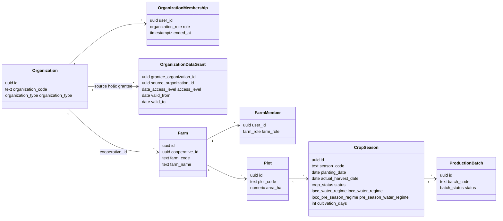
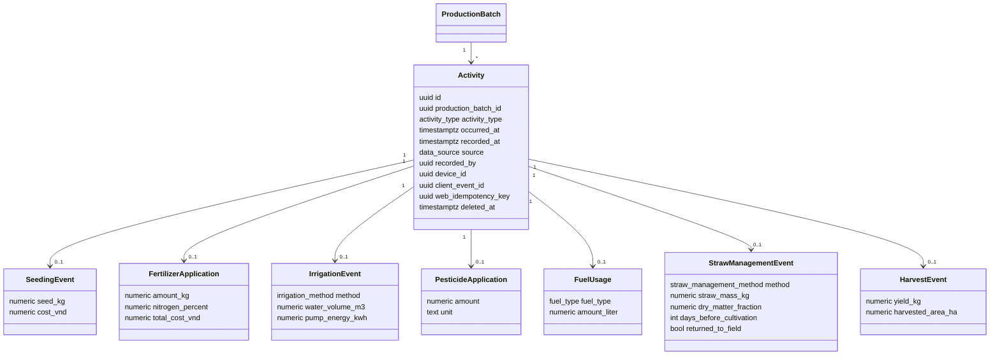
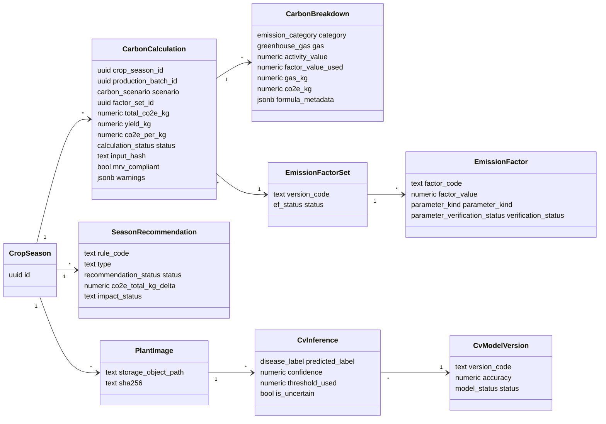
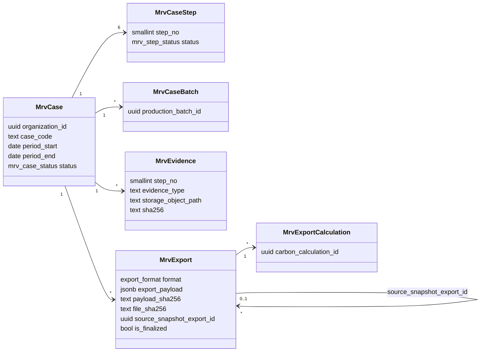

# Domain model

Mô hình miền lấy từ migration thực tế (`supabase/migrations/`). Chỉ các field
quan trọng cho việc hiểu hệ thống được đưa vào sơ đồ; danh sách cột đầy đủ xem
[Database schema](../database/schema.md).

## Phân cấp lõi

```text
Organization (HTX)
 └─ Farm (nông hộ)
     └─ Plot (thửa, có area_ha)
         └─ Crop Season (vụ canh tác)  ← PHẠM VI tính Carbon, metrics, khuyến nghị, CV
             ├─ Production Batch       ← chỉ để truy xuất nguồn gốc / neo activity
             │   └─ Activity + bảng chi tiết (seeding, fertilizer, irrigation,
             │                              pesticide, fuel, straw, harvest)
             ├─ Carbon Calculation → Carbon Breakdown
             ├─ Season Recommendation
             └─ Plant Image → CV Inference
MRV Case (thuộc Organization) ─ liên kết Production Batch qua mrv_case_batches
```

!!! note "Batch là truy xuất nguồn gốc, không phải phạm vi Carbon"
    `activities.production_batch_id` là `NOT NULL`, nên mọi hoạt động phải neo vào
    một lô. Nhưng migration `20260908000002_crop_season_carbon_scope.sql` khoá phạm
    vi bản tính vào `carbon_calculations.crop_season_id` (bắt buộc) và biến
    `production_batch_id` thành tuỳ chọn. Repository Carbon gom activity của **mọi
    lô chưa xoá** trong vụ (`SupabaseCarbonRepository.get_crop_bundle`).
    Flutter tự tạo một lô `batch_code = 'default'` cho mỗi vụ; Farmer Web yêu cầu
    vụ có **đúng một** lô đang mở mới cho ghi.

## 1. Tổ chức, nông hộ và vụ



## 2. Hoạt động canh tác



Mỗi bảng chi tiết dùng `activity_id` làm khoá chính; trigger
`private.enforce_activity_type` bảo đảm bảng chi tiết khớp `activity_type`.

## 3. Kết quả theo vụ



`carbon_calculations.co2e_per_kg` là cột generated
`total_co2e_kg / nullif(yield_kg, 0)`; `cv_inferences.is_uncertain` là cột
generated `confidence < threshold_used`.

## 4. MRV



## Bảng có trong schema nhưng chưa được code ứng dụng dùng

Migration baseline còn định nghĩa `resource_metric_snapshots`,
`benchmark_snapshots`, `benchmark_snapshot_members`, `recommendation_rules`,
`recommendations`, `ingestion_batches`, `data_quality_flags`, `sync_batches`, các
view `v_*`, schema `audit` và `pm`. Không có code backend/web/Flutter nào đọc hay
ghi các bảng/view này (đã grep). Khuyến nghị M05 dùng bảng riêng
`season_recommendations`; chỉ số tài nguyên được tính trực tiếp khi đọc, không
lưu snapshot.
