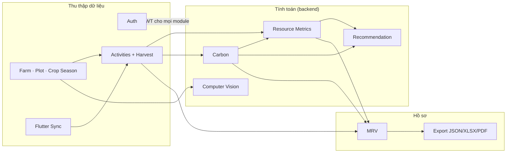

# Module map

Mỗi module dưới đây liệt kê **đúng tên class/file/bảng/route trong code**. Đường
dẫn backend tính từ `backend/`, web từ `web-dashboard/src/`, Flutter từ `app/lib/`.

## Tổng quan phụ thuộc

## Auth

| Mục | Chi tiết |
|---|---|
| Trách nhiệm | Đăng nhập, giữ phiên, xác định người gọi và role |
| Input | Email + mật khẩu (Supabase Auth); header `Authorization: Bearer <JWT>` |
| Output | JWT; `GET /v1/me` → `user_id`, `full_name`, `organization_memberships`, `farm_memberships`, `roles` |
| Service / repository | `infrastructure/auth.py` (`extract_bearer_token`, `SupabaseCropAccessChecker`, `jwt_rejection_as_invalid_token`), `SupabaseReadRepository.me()` |
| Bảng | `auth.users`, `profiles`, `organization_memberships`, `farm_members` |
| API | `GET /v1/me` |
| Frontend | Web: `api/auth.ts`, `utils/supabase.ts`, `api/me.ts`; Flutter: `services/auth_service.dart`, `shell/auth_gate.dart`, `services/me_service.dart` |

## Farm / Plot / Crop Season

| Mục | Chi tiết |
|---|---|
| Trách nhiệm | Phân cấp tổ chức → nông hộ → thửa → vụ, là khung phạm vi cho mọi dữ liệu khác |
| Input | Không có API tạo/sửa; Flutter upsert `plots` và `crop_seasons` trực tiếp qua RLS; nông hộ và tổ chức tạo ngoài ứng dụng (DB/seed) |
| Output | Farm (kèm `plot_count`), Plot, Crop Season (`status`, ngày gieo/thu hoạch) |
| Repository | `SupabaseReadRepository.farms/farm/plots_for_farm/plot/season/seasons_for_plot/farmer_scope` |
| Bảng | `organizations`, `farms`, `farm_members`, `plots`, `crop_seasons`, `production_batches` |
| API | `GET /v1/farmer/scope`, `/v1/farms`, `/v1/farms/{id}`, `/v1/farms/{id}/plots`, `/v1/farms/{id}/crop-seasons`, `/v1/plots/{id}`, `/v1/plots/{id}/crop-seasons`, `/v1/crop-seasons/{id}`, `/v1/crop-seasons/{id}/production-batches`, `/v1/production-batches/{id}` |
| Frontend | Farmer: `farmer/scope.ts`, `farmer/pages/Farms.tsx`; Management: `pages/directory.tsx`, `pages/season.tsx`; Flutter: `screens/farm_screen.dart`, `plot_screen.dart`, `crop_season_*` |

## Activities

| Mục | Chi tiết |
|---|---|
| Trách nhiệm | Nhật ký canh tác theo vụ: tạo, sửa, xoá mềm, idempotent |
| Input | Web: `ActivityCreateRequest` (`idempotency_key`, `activity_type`, `occurred_at`, `note`, `data`); Flutter: hàng SQLite |
| Output | `ActivityWriteResponse` (có `idempotent_replay`); danh sách `ActivityResponse` |
| Service | `ActivityWriteService` (`service.py`) |
| Repository | `PostgresActivityWriteRepository` (`infrastructure/write_repo.py`); đọc: `SupabaseReadRepository.activities/activity` |
| Bảng | `activities`, `seeding_events`, `fertilizer_applications`, `irrigation_events`, `pesticide_applications`, `fuel_usages`, `straw_management_events`, `harvest_events` |
| API | `GET /v1/crop-seasons/{id}/activities`, `GET /v1/activities/{id}`, `POST /v1/crop-seasons/{id}/activities`, `PATCH /v1/activities/{id}`, `DELETE /v1/activities/{id}` |
| Frontend | Farmer: `api/activities.ts`, `farmer/ActivityForms.tsx`, `farmer/journal.tsx`, `farmer/idempotency.ts`; Management: `features/activities.tsx` (chỉ đọc); Flutter: `screens/activity_form_screen.dart`, `services/sync_service.dart` |
| Loại hỗ trợ | Web: `seeding`, `fertilizer`, `irrigation`, `pesticide`, `straw_management`, `harvest`. Flutter: thêm `fuel` |

## Harvest

| Mục | Chi tiết |
|---|---|
| Trách nhiệm | Nguồn **duy nhất** của sản lượng — mẫu số cho mọi chỉ số trên kg |
| Input | Activity `harvest` với `yield_kg > 0` (DB check), `harvested_area_ha`, `moisture_percent`, `total_cost_vnd` |
| Output | `yield_kg` của vụ = tổng `harvest_events.yield_kg` của activity chưa xoá |
| Code | `infrastructure/mapping.py::_total_yield` (Carbon), `read_repo.py::_compute_metric_totals` (metrics), `mrv/manifest.py::_harvest_section` (MRV) |
| Bảng | `harvest_events` |

## Carbon

| Mục | Chi tiết |
|---|---|
| Trách nhiệm | Tính CO₂e của một vụ theo IPCC, lưu kết quả kèm phân rã và nguồn hệ số |
| Input | `crop_season_id`, `water_regime_scenario` ∈ `as_recorded`/`awd`/`continuous_flooding` |
| Output | `total_co2e_kg`, `co2e_per_kg`, `breakdown[]`, `warnings[]`, `input_hash`, `ef_config_version`, `engine_version`, `calculation_id` |
| Service | `CarbonService.calculate(persist=True/False)`, `CarbonService.latest` |
| Engine | `carbon/engine.py::calculate_carbon`, `carbon/methodology.py`, `carbon/factors.py::ParameterSet` |
| Repository | `SupabaseCarbonRepository`, `infrastructure/mapping.py` |
| Bảng | `carbon_calculations`, `carbon_breakdowns`, `emission_factor_sets`, `emission_factors` |
| API | `POST /v1/carbon/calculate`, `GET /v1/crop-seasons/{id}/carbon`, `GET /v1/carbon/scenarios`, `GET /v1/emission-factor-sets[...]` |
| Frontend | Management: `features/carbon.tsx`; Farmer: `farmer/pages/Carbon.tsx` (chỉ đọc); Flutter: `screens/carbon_result_screen.dart`, `services/carbon_api_service.dart` |

## Resource Metrics

| Mục | Chi tiết |
|---|---|
| Trách nhiệm | Nước, phân bón, chi phí, CO₂e trên mỗi kg; cờ đầy đủ dữ liệu; tổng hợp theo farm/tổ chức |
| Input | Activity + chi tiết của vụ, bản tính Carbon thành công mới nhất (`scenario = actual`) |
| Output | `MetricResponse`, `OrganizationSummaryResponse`, `FarmPerformanceResponse` |
| Code | `SupabaseReadRepository._compute_metric_totals`, `_aggregate_from_totals`, `organization_summary`, `farm_performance` (không có service riêng) |
| Bảng | Đọc: activity + chi tiết, `carbon_calculations` (không lưu snapshot) |
| API | `GET /v1/crop-seasons/{id}/metrics`, `/v1/farms/{id}/metrics`, `/v1/organizations/{id}/metrics`, `/summary`, `/farm-performance` |
| Frontend | Farmer: `farmer/metricsView.ts`, `farmer/pages/Performance.tsx`; Management: `pages/performance.tsx`, `components/FarmPerformanceTable.tsx`; Flutter: `screens/resource_dashboard_screen.dart` |

## Recommendation

| Mục | Chi tiết |
|---|---|
| Trách nhiệm | Khuyến nghị xác định theo rule; tác động carbon luôn đến từ Carbon Engine |
| Input | `crop_season_id`; metrics của vụ; `CarbonService` |
| Output | `RecommendationResponse` (`type` = `optimization`/`data_task`, `impact_status`, `co2e_total_kg_before/after/delta`) |
| Service / engine | `RecommendationService`; `recommendation/engine.py::generate_recommendations`; `recommendation/rules.py` |
| Repository | `PostgresRecommendationRepository` |
| Bảng | `season_recommendations` |
| API | `GET /v1/crop-seasons/{id}/recommendations`, `POST .../recommendations/generate`, `PATCH /v1/recommendations/{id}` |
| Frontend | Farmer: `api/recommendations.ts`, `farmer/Recommendations.tsx`. Flutter: **chưa nối** (`UnavailableRecommendationRepository`) |

## Computer Vision

| Mục | Chi tiết |
|---|---|
| Trách nhiệm | Upload ảnh lá → kiểm tra → suy luận baseline → lưu → đọc lại |
| Input | Multipart `file` JPEG/PNG ≤ 10 MB, cạnh ≥ 32 px |
| Output | `CvInferenceResponse` (`label` hoặc `null`, `confidence`, `uncertain`, `threshold_used`, `model_version`) |
| Service | `CvService`; `ml/infer.py::predict_with_model` |
| Repository | `PostgresCvRepository` + Storage bucket `plant-images` |
| Bảng | `plant_images`, `cv_inferences`, `cv_model_versions` |
| API | `POST /v1/crop-seasons/{id}/cv/infer`, `GET /v1/crop-seasons/{id}/cv/inferences`, `GET /v1/cv/inferences/{id}` |
| Frontend | Farmer: `api/cv.ts`, `farmer/CvCheck.tsx`. Flutter: **chưa nối** (`UnavailableCvInferenceService`) |

## MRV

| Mục | Chi tiết |
|---|---|
| Trách nhiệm | Hồ sơ MRV 6 bước theo tổ chức, gắn lô sản xuất, bằng chứng |
| Input | Không có API tạo/sửa case, step, evidence — dữ liệu này tạo trực tiếp trong DB (RLS cho `cooperative_manager`) hoặc qua script seed |
| Output | `MrvCaseResponse` (6 bước luôn đủ), `MrvBatchResponse`, `MrvEvidenceResponse` (metadata, không có signed URL) |
| Repository | `SupabaseReadRepository.mrv_cases/mrv_case/mrv_steps/mrv_batches/mrv_evidence` |
| Bảng | `mrv_step_catalog`, `mrv_cases`, `mrv_case_steps`, `mrv_case_batches`, `mrv_evidence` |
| API | `GET /v1/mrv/cases`, `/v1/mrv/cases/{id}`, `/steps`, `/batches`, `/evidence` |
| Frontend | Management: `api/mrv.ts`, `pages/mrv.tsx`, `utils/mrvPresentation.ts` |

## Export (MRV JSON / XLSX / PDF)

| Mục | Chi tiết |
|---|---|
| Trách nhiệm | Snapshot JSON chuẩn của một case; render XLSX/PDF từ snapshot; tải về có kiểm SHA-256 |
| Input | `mrv_case_id` + `format`; hoặc `mrv_export_id` + `format` để render lại |
| Output | `MrvExportCreatedResponse` / `MrvArtifactResponse`; bytes khi download |
| Service | `MrvExportService` |
| Thư viện | `mrv/manifest.py`, `mrv/workbook.py` (openpyxl), `mrv/report_pdf.py` (ReportLab + font Be Vietnam Pro) |
| Repository | `PostgresMrvExportRepository` + bucket `mrv-exports` |
| Bảng | `mrv_exports`, `mrv_export_calculations` |
| API | `POST /v1/mrv/cases/{id}/exports`, `POST /v1/mrv/exports/{id}/render`, `GET /v1/mrv/cases/{id}/exports`, `GET /v1/mrv/exports/{id}`, `GET /v1/mrv/exports/{id}/download` |
| Frontend | Management: `pages/mrv.tsx` (nút xuất chỉ hiện với `cooperative_manager`) |

## Flutter Sync

| Mục | Chi tiết |
|---|---|
| Trách nhiệm | Đẩy dữ liệu offline lên Supabase, kéo Farm/Plot/Season về cache |
| Input | Hàng SQLite có `sync_state` ∈ `pending`/`failed` |
| Output | `SyncSummary`; trạng thái tổng `SyncStatus` |
| Code | `services/sync_service.dart`, `sync_coordinator.dart`, `sync_gateway.dart`, `sync_errors.dart`, `device_service.dart`, `db/local_database.dart` |
| Bảng Supabase | `plots`, `crop_seasons`, `production_batches`, `activities` + 7 bảng chi tiết, `devices`, RPC `soft_delete_activity` |
| API FastAPI | Không dùng cho sync |
