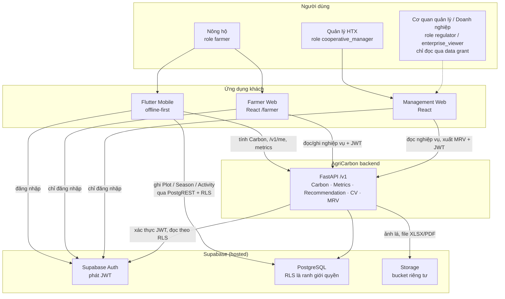
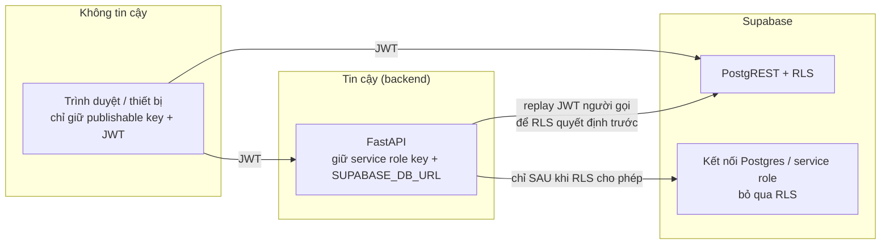

# System context

Trang này mô tả AgriCarbon ở mức cao nhất: **ai** dùng hệ thống, **qua ứng dụng
nào**, và hệ thống **phụ thuộc vào đâu**. Mọi mũi tên đều đối chiếu với code
(`app/lib/services/*`, `web-dashboard/src/api/*`, `backend/main.py`, `backend/api.py`).

## Sơ đồ ngữ cảnh

## Tác nhân

| Tác nhân | Role trong DB | Ứng dụng | Ghi chú đối chiếu code |
|---|---|---|---|
| Nông hộ | `organization_role = farmer` + `farm_members.farm_role` (`owner`/`editor`/`viewer`) | Flutter, Farmer Web | Farmer Web chỉ mở khu `/farmer/*` khi role phân giải là `farmer` (`web-dashboard/src/App.tsx`) |
| Quản lý HTX | `cooperative_manager` | Management Web | Role duy nhất được tạo/tải gói xuất MRV (`MrvExportService.MANAGEMENT_ROLE`) |
| Cơ quan quản lý | `regulator` | Management Web | Chỉ đọc dữ liệu của tổ chức nguồn qua `organization_data_grants` còn hiệu lực |
| Doanh nghiệp | `enterprise_viewer` | (xem ghi chú) | RLS cho đọc qua data grant, nhưng web đang so khớp chuỗi `enterprise` thay vì `enterprise_viewer` nên tài khoản chỉ có role này bị đưa vào khu Farmer — xem [Giới hạn](../limitations/current-limitations.md) |

## Hệ thống phụ thuộc

| Hệ thống | Vai trò | Trạng thái |
|---|---|---|
| Supabase Auth | Đăng nhập email/mật khẩu, phát JWT | Đang dùng (Flutter `supabase_flutter`, web `@supabase/supabase-js`) |
| Supabase PostgreSQL | Dữ liệu nghiệp vụ, RLS, trigger toàn vẹn | Đang dùng; schema ở `supabase/migrations/` |
| Supabase Storage | Bucket `plant-images`, `mrv-exports` (riêng tư); `mrv-evidence` có policy nhưng chưa có luồng upload trong API | Bucket tạo thủ công (migration cố ý không insert `storage.buckets`) |
| Bộ tham số phát thải | `backend/config/emission_factors.yaml` (nguồn giá trị) + bảng `emission_factor_sets`/`emission_factors` (bản sao để liên kết) | GWP và nhiên liệu chưa xác minh |
| Checkpoint mô hình CV | `ml/runs/<run>/model.pt` + `eval_metrics.json`, nạp một lần khi backend khởi động | Thư mục `ml/runs/` **không được git track** — clone mới phải tự train/đặt checkpoint |
| RiceMoRe / FarMoRe | Hệ thống bên ngoài được nhắc trong YAML | `api: NOT_AVAILABLE` — **không tích hợp** |

Không có tích hợp IoT, thời tiết, bản đồ, sàn tín chỉ carbon hay hệ thống thanh
toán nào trong code hiện tại.

## Ranh giới tin cậy

Nguyên tắc đọc được từ code:

1. Client **không bao giờ** có service role key (`backend/.env.example`,
   `app/README.md`, `web-dashboard/src/utils/supabase.ts`).
2. Backend **không tự quyết định quyền bằng Python** cho dữ liệu nông hộ: trước
   khi dùng kết nối có quyền cao, nó đọc lại bản ghi bằng **JWT của người gọi**
   qua publishable key để RLS trả lời (`infrastructure/auth.py`,
   `infrastructure/read_repo.py`). Ngoại lệ đã biết: một số đường ghi chỉ kiểm tra
   quyền **đọc** trước khi ghi bằng kết nối bỏ qua RLS — xem
   [Phát hiện kiểm toán](../limitations/implementation-audit-findings.md) (B3, B4, B7).
3. "Không có quyền" và "không tồn tại" cùng trả **404** để không lộ sự tồn tại
   của dữ liệu nông hộ khác.
