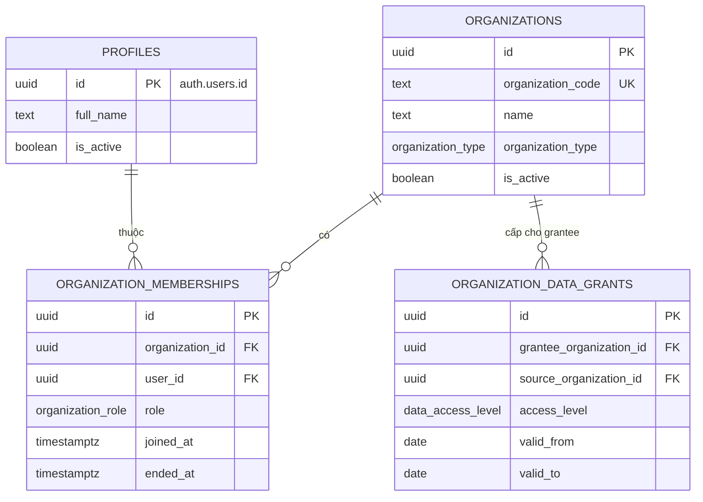
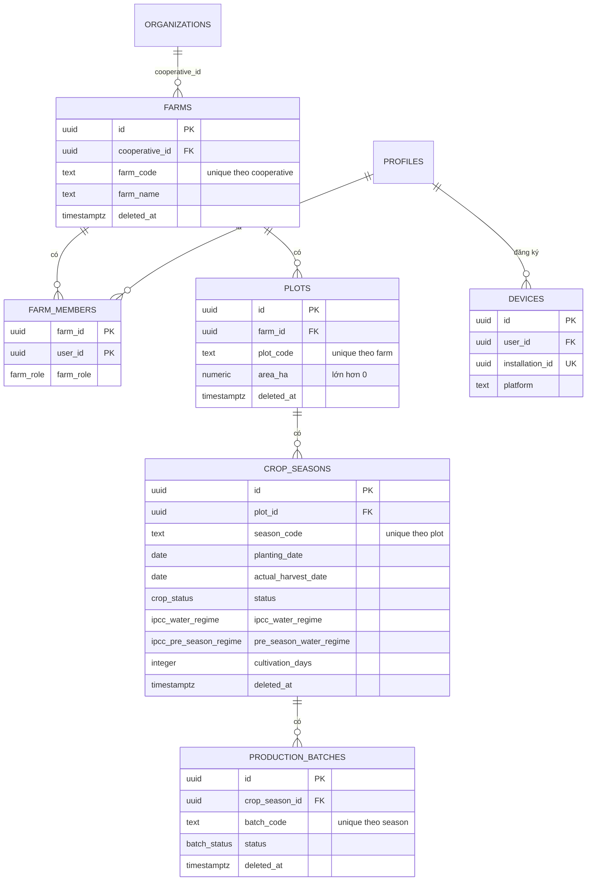
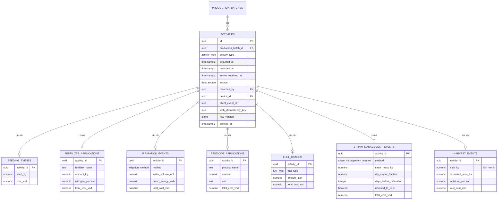
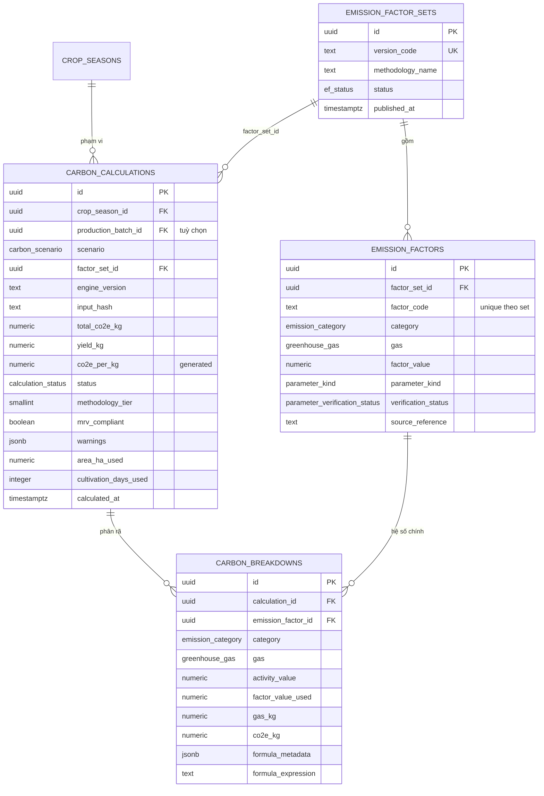
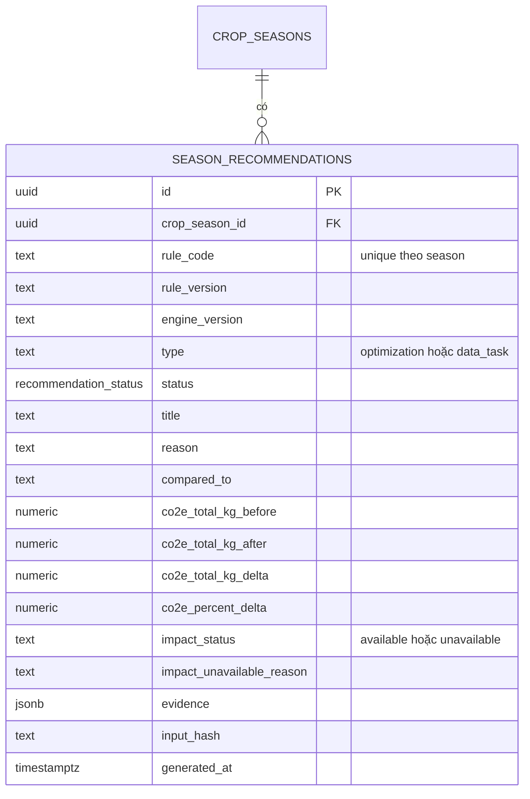
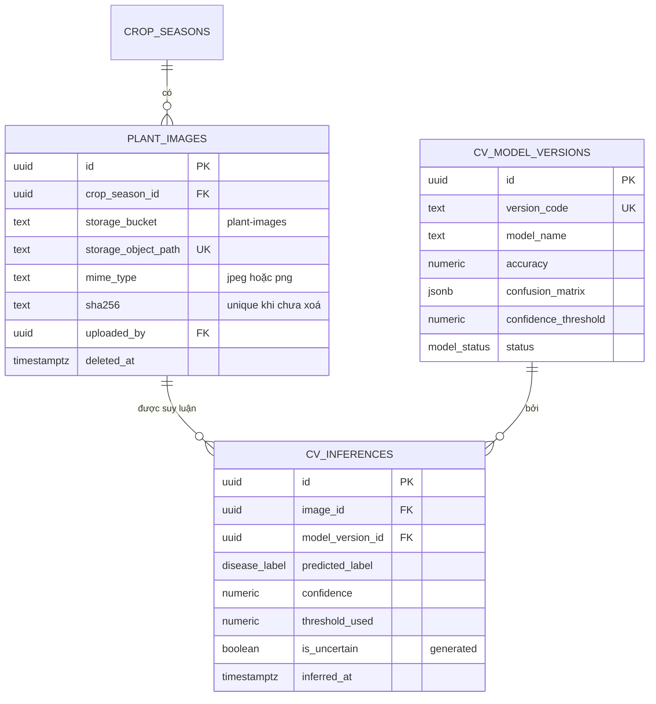
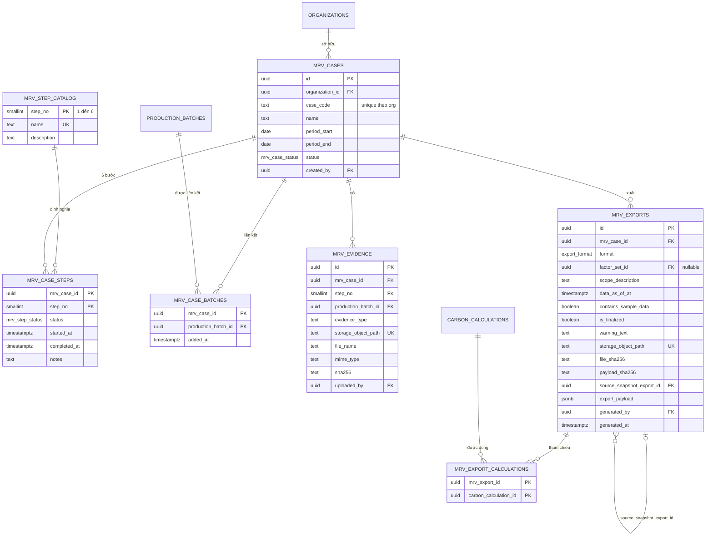

# Database schema

Nguồn sự thật: chuỗi migration trong `supabase/migrations/`. Trang này mô tả các
bảng **ứng dụng đang dùng**, gom theo nhóm, kèm ER diagram từng nhóm. Tên bảng,
cột và enum giữ nguyên như trong SQL.

## Chuỗi migration

| File | Nội dung chính |
|---|---|
| `20260907000000_baseline.sql` | Toàn bộ schema gốc: enum, bảng nghiệp vụ, trigger toàn vẹn, hàm RLS `private.*`, policy, view, schema `audit` và `pm`, policy Storage |
| `20260908000000_carbon_methodology_alignment.sql` | Enum `parameter_kind`, `parameter_verification_status`, `ipcc_water_regime`, `ipcc_pre_season_regime`; cột methodology trên `crop_seasons`, `straw_management_events`, `emission_factors`, `carbon_breakdowns`, `carbon_calculations`; view `v_carbon_results_detailed` |
| `20260908000001_carbon_calculation_scope_audit.sql` | `carbon_calculations.crop_season_id`, `area_ha_used`, `cultivation_days_used`, `water_regime_applied`, `pre_season_water_regime_applied` |
| `20260908000002_crop_season_carbon_scope.sql` | Khoá phạm vi bản tính vào crop season; `production_batch_id` thành tuỳ chọn; trigger kiểm lô cùng vụ; policy đọc theo crop season |
| `20260908000003_carbon_success_allows_unknown_yield.sql` | `succeeded` không còn bắt buộc `yield_kg` |
| `20260908134822_grant_private_schema_service_role.sql` | `grant usage on schema private to service_role` |
| `20260910080441_farmer_web_activity_idempotency.sql` | `activities.web_idempotency_key` + unique index `(recorded_by, web_idempotency_key)` |
| `20260911120000_season_recommendations.sql` | Bảng `season_recommendations` + RLS đọc |
| `20260913090000_allow_owner_soft_delete_activities.sql` | RPC `public.soft_delete_activity`, helper `private.user_can_delete_activity`, trigger giữ bất biến chủ sở hữu |
| `20260913120000_mrv_json_export_manifest.sql` | `export_format` thêm `json`; `mrv_exports.factor_set_id` thành nullable |
| `20260913150000_mrv_xlsx_export_artifacts.sql` | `source_snapshot_export_id`, `payload_sha256`, ràng buộc lineage; siết `mrv_exports_select` về manager |

Không có migration riêng cho PDF: giá trị `pdf` đã có trong enum `export_format`
từ baseline.

## 1. Organization / Membership

- `organization_role`: `farmer`, `cooperative_manager`, `enterprise_viewer`, `regulator`.
- `organization_type`: `cooperative`, `enterprise`, `government`, `research`, `other`.
- Trigger `on_auth_user_created` (`private.handle_new_user`) tạo `profiles` khi có user mới.
- `ended_at` trong quá khứ nghĩa là membership hết hiệu lực — mọi helper RLS và
  `MrvExportService._manages` đều kiểm tra điều này.

## 2. Farm / Plot / Season / Batch

- `farm_role`: `owner`, `editor`, `viewer`.
- `crop_status` / `batch_status`: `planned`, `active`, `harvested`, `closed`, `cancelled`.
- Farmer Web chỉ cho ghi khi `crop_seasons.status = 'active'`.
- Các cột phương pháp luận trên `crop_seasons` (`ipcc_water_regime`,
  `pre_season_water_regime`, `cultivation_days`, `drainage_event_count`) nullable;
  thiếu thì Carbon Engine báo lỗi thay vì đoán.

## 3. Activities

| Ràng buộc | Ý nghĩa |
|---|---|
| `activities_device_event_pair_chk` | `device_id` và `client_event_id` cùng null hoặc cùng có |
| `activities_mobile_device_chk` | `source` là `mobile_offline`/`mobile_online` thì bắt buộc `device_id` |
| `activities_device_event_uidx` | Unique `(device_id, client_event_id)` (partial) — idempotency của Flutter |
| `activities_web_idempotency_uidx` | Unique `(recorded_by, web_idempotency_key)` (partial) — idempotency của Farmer Web |
| `private.enforce_activity_type` | Bảng chi tiết phải khớp `activity_type` của activity cha |
| `enforce_activity_ownership_immutable_trg` | Khi RLS đang áp: không đổi `recorded_by` đã có, `activity_type`, `device_id`, `client_event_id` |
| `touch_activity_row_trg` | Tăng `row_version`, cập nhật `updated_at` |

Enum liên quan: `activity_type` (`seeding`, `fertilizer`, `irrigation`, `pesticide`,
`fuel`, `straw_management`, `harvest`, `other`), `data_source` (`mobile_offline`,
`mobile_online`, `web`, `api`, `import`, `system`), `irrigation_method` (`awd`,
`continuous_flooding`, `alternate`, `other`), `straw_management_method`
(`incorporated`, `removed`, `burned`, `composted`, `other`), `fuel_type` (`diesel`,
`gasoline`, `lpg`, `other`).

## 4. Carbon

- `carbon_scenario`: `actual`, `awd`, `continuous_flooding` — engine gọi `actual`
  là `as_recorded` (`carbon/models.py::SCENARIO_TO_DB`).
- `calculation_status`: `pending`, `succeeded`, `failed`, `superseded`. Backend chỉ
  ghi `succeeded`; lỗi tính không được lưu thành hàng.
- `carbon_success_chk`: `succeeded` bắt buộc `total_co2e_kg` và không có `failure_reason`.
- `carbon_calculations_season_input_uniq`: unique `(crop_season_id, scenario, factor_set_id, input_hash)`
  cho bản tính cả vụ (`production_batch_id is null`).
- `carbon_breakdown_multiparam_needs_metadata_chk`: dòng `irrigation_ch4` bắt buộc có `formula_metadata`.
- `ef_verified_needs_table_reference_chk`: tham số `VERIFIED` bắt buộc có `source_table_reference`.
- `mrv_compliant` mặc định `false` và backend luôn ghi `false`.

## 5. Recommendation

`recommendation_status`: `generated`, `accepted`, `dismissed`, `expired`. Bảng
baseline `recommendations` / `recommendation_rules` / `benchmark_snapshots` /
`resource_metric_snapshots` **không được code dùng**.

## 6. Computer Vision

- `disease_label`: `rice_blast`, `bacterial_leaf_blight`, `brown_spot`, `healthy`, `unknown`.
  Backend ghi `unknown` khi độ tin cậy dưới ngưỡng và API trả `label: null`.
- `cv_model_versions` do backend tạo với `status = 'draft'`; policy đọc của
  `authenticated` chỉ thấy `active`/`retired` (backend đọc bằng kết nối riêng).
- Trigger `private.validate_plant_image_path`: đường dẫn phải là `<farm_uuid>/<crop_season_uuid>/<file>`.

## 7. MRV và Exports

- `mrv_step_catalog` được seed 6 bước với tên tiếng Anh (`Preparation`, `Registration`,
  `Baseline`, `Measurement`, `Reporting`, `Verification`); API hiển thị nhãn tiếng
  Việt cố định trong `read_repo.py::MRV_STEP_LABELS`.
- Trigger `populate_mrv_steps_trg` tự tạo 6 dòng `mrv_case_steps` khi insert case.
- `mrv_case_status`: `draft`, `in_progress`, `ready_for_verification`, `verified`, `closed`
  (giá trị lưu trong DB, không phải kết luận của AgriCarbon).
- `mrv_step_status`: `not_started`, `in_progress`, `completed`, `blocked`.
- `export_format`: `pdf`, `xlsx`, `json`.
- `mrv_export_warning_chk`: gói chưa finalized phải có `warning_text` — backend luôn ghi
  `is_finalized = false` kèm disclaimer.
- `mrv_export_snapshot_lineage_chk`: `json` không có `source_snapshot_export_id`; `xlsx`/`pdf` bắt buộc có.
- Trigger `validate_mrv_evidence_path_trg` / `validate_mrv_export_path_trg`: đường dẫn
  `<organization_uuid>/<mrv_case_uuid>/<file>`.

## Storage

| Bucket | Đường dẫn | Ghi bởi | Policy `storage.objects` cho `authenticated` |
|---|---|---|---|
| `plant-images` | `<farm_uuid>/<crop_season_uuid>/<file>` | Backend (service role) | Đọc: `user_can_read_farm`; ghi/sửa/xoá: `user_can_write_farm`, đuôi `jpg/jpeg/png` |
| `mrv-evidence` | `<organization_uuid>/<mrv_case_uuid>/<file>` | Chưa có luồng upload trong code | Đọc: `user_can_read_organization`; ghi: `user_is_org_manager` |
| `mrv-exports` | `<organization_uuid>/<mrv_case_uuid>/<file>` | Backend (service role), chỉ XLSX/PDF | Đọc: `user_can_read_organization`; ghi: `user_is_org_manager` |

Backend **không** cấp signed URL; artifact MRV chỉ tải qua
`GET /v1/mrv/exports/{id}/download` sau khi kiểm quyền và SHA-256.

!!! bug "Policy đọc Storage của `mrv-exports` rộng hơn metadata"
    `mrv_files_storage_select` (baseline) cho `user_can_read_organization` — gồm
    `farmer` của tổ chức và `enterprise_viewer`/`regulator` qua data grant — đọc
    object trong `mrv-exports`, trong khi `mrv_exports_select` đã siết về manager
    (migration `20260913150000`). Ứng dụng không gọi Storage trực tiếp, nhưng policy
    không phụ thuộc ứng dụng: ai có JWT hợp lệ vẫn gọi được Storage API. Đây là lỗ
    hổng đã biết, chưa sửa ([M7](../limitations/implementation-audit-findings.md#m7)).
