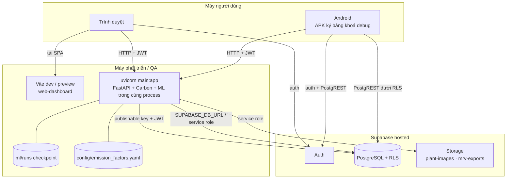
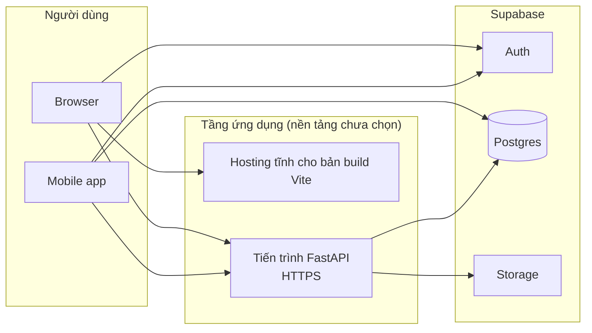

# Kiến trúc triển khai

!!! note "Nền tảng triển khai chưa được chốt"
    Repository **không** có Dockerfile, docker-compose, cấu hình Kubernetes, CI/CD,
    Procfile hay cấu hình nhà cung cấp hosting nào (đã kiểm tra `git ls-files`).
    `infra/README.md` ghi rõ: "Chưa chốt. Quyết định sau khi 1a chạy end-to-end".
    Trang này mô tả **topology đang chạy thực tế** và **các ràng buộc triển khai suy ra
    từ code**, không đề xuất một nhà cung cấp cụ thể.

## Topology đang dùng

Theo `AGENTS.md` và các báo cáo trong `docs/`, môi trường phát triển/QA hiện tại là:
backend chạy local bằng uvicorn, web chạy bằng Vite dev server hoặc `vite preview`,
kết nối tới **một dự án Supabase hosted**; Flutter chạy trên emulator/thiết bị Android.

## Topology tổng quát khi triển khai

## Ràng buộc triển khai suy ra từ code

| Chủ đề | Ràng buộc | Nguồn |
|---|---|---|
| HTTPS | Bản release Android chặn cleartext; iOS giữ ATS mặc định (chỉ HTTPS) → backend production phải có HTTPS | `app/android/app/src/main/res/xml/network_security_config.xml`, `app/README.md` |
| CORS | Origin của web phải nằm trong `AGRICARBON_CORS_ORIGINS` | `backend/main.py` |
| Web build | `npm run build` (`tsc -b && vite build`); URL API được nhúng lúc build qua `VITE_API_BASE_URL` | `web-dashboard/package.json` |
| Dependency backend | Cần cả `backend/requirements.txt` **và** `torch`, `torchvision`, `pillow` (import `ml.infer` khi khởi động) | `backend/service.py` |
| Artifact CV | Thư mục `ml/runs/<run>/` với `model.pt` + `eval_metrics.json` phải có trên máy chạy backend; thiếu thì CV `503` | `backend/main.py` |
| Thư mục làm việc | `uvicorn main:app` chạy từ `backend/`; `service.py` tự thêm repo root vào `sys.path` để import `ml` | `backend/service.py` |
| Bí mật | `SUPABASE_SERVICE_ROLE_KEY`, `SUPABASE_DB_URL` chỉ ở backend | `backend/.env.example` |
| Database | Chạy đủ 12 migration; tạo thủ công 3 bucket riêng tư; import + publish bộ hệ số trùng `version_code` YAML | `supabase/migrations/`, baseline §22 |
| Kết nối Postgres | Pool `psycopg_pool` tối đa 8 kết nối mỗi process; không có `psycopg_pool` thì mở kết nối theo từng câu lệnh | `infrastructure/pg_pool.py` |
| Trạng thái trong process | Cache Supabase client theo token (32 client, TTL 600 s) và pool Postgres là **theo từng process** | `supabase_clients.py`, `pg_pool.py` |
| Thời gian request | Tạo gói MRV chạy đồng bộ trong request (tổng hợp đo khoảng 8 giây trên hosted dev) → proxy/timeout phải cho phép | `docs/MRV_EXPORT_PACKAGE.md` |
| Job nền | Không có cron, hàng đợi hay worker (đã grep); mọi tính toán chạy theo request | — |
| Flutter release | Chưa có khoá ký release; iOS cần macOS + Xcode + Apple signing | `app/android/app/build.gradle.kts` |

## Migration và dữ liệu

- Chuỗi migration áp dụng bằng Supabase CLI (`supabase/config.toml`); lịch sử áp dụng
  lên hosted ghi ở `docs/MIGRATION_HISTORY.md`.
- Không có migration nào seed hệ số phát thải hay mô hình CV (baseline cố ý không seed).
- Tenant demo `DEMO-AGRICARBON-2026` được tạo bằng `backend/scripts/seed_demo_data.py`
  và dọn bằng `cleanup_demo_data.py`.
