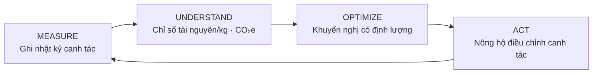
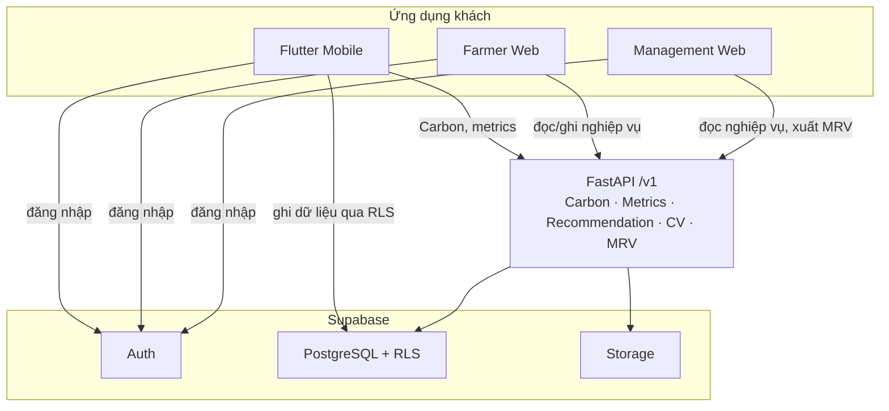

# AgriCarbon

AgriCarbon là nền tảng quản lý canh tác lúa theo hướng **tối ưu tài nguyên** và
**theo dõi phát thải carbon ở cấp nông hộ / hợp tác xã (HTX)**. Hệ thống ghi nhật
ký canh tác theo từng vụ, tính chỉ số tài nguyên trên mỗi kg thóc, tính CO₂e theo
phương pháp IPCC (khi bộ hệ số đủ điều kiện), sinh khuyến nghị có định lượng, hỗ
trợ nhận diện bệnh lá lúa bằng ảnh, và đóng gói hồ sơ MRV thành gói bằng chứng.

!!! warning "Đọc trước khi dùng số liệu"
    - Carbon Engine **sẵn sàng về kỹ thuật** nhưng **chưa sẵn sàng về khoa học**:
      GWP của CH₄/N₂O và hệ số nhiên liệu đang `PENDING_VERIFICATION`
      (`backend/config/emission_factors.yaml`), nên với cấu hình hiện tại mọi lần
      tính CO₂e thật đều dừng với lỗi `422 missing_emission_factor`.
    - Hệ thống **không** được chứng nhận, **không** phải công cụ chính thức và
      **không** được gắn nhãn MRV-compliant. Gói xuất MRV là gói dữ liệu/bằng
      chứng hỗ trợ, không phải chứng nhận.
    - Mô hình Computer Vision là **thử nghiệm**, **chưa xác thực thực địa**.

    Chi tiết: [Giới hạn hiện tại](limitations/current-limitations.md).

## Vòng lặp sản phẩm

| Bước | Hệ thống làm gì (theo code hiện tại) |
|---|---|
| MEASURE | Flutter ghi offline rồi đồng bộ lên Supabase; Farmer Web ghi trực tuyến qua FastAPI |
| UNDERSTAND | `GET /v1/crop-seasons/{id}/metrics` (nước, phân, chi phí, CO₂e trên mỗi kg); Carbon Engine tính CO₂e theo vụ |
| OPTIMIZE | Rule engine xác định (deterministic): gợi ý AWD có tác động tính bằng chính Carbon Engine, và gợi ý bổ sung dữ liệu |
| ACT | Nông hộ chấp nhận / bỏ qua khuyến nghị, ghi tiếp hoạt động của vụ |

## Ba trải nghiệm người dùng

| Trải nghiệm | Công nghệ | Người dùng | Cách truy cập dữ liệu |
|---|---|---|---|
| **Flutter Mobile** | Flutter (Android đã build; iOS chưa build được trên Windows) | Nông hộ | Offline-first: SQLite local → **ghi thẳng Supabase qua RLS**; gọi FastAPI cho Carbon, `/v1/me`, metrics |
| **Farmer Web** | React + Vite, khu vực `/farmer/*` | Nông hộ (role `farmer`) | Supabase chỉ dùng cho đăng nhập; **mọi đọc/ghi nghiệp vụ qua FastAPI** |
| **Management Web** | React + Vite, cùng ứng dụng web | Quản lý HTX (`cooperative_manager`), cơ quan quản lý (`regulator`) | Supabase chỉ dùng cho đăng nhập; mọi dữ liệu qua FastAPI |

Phía dưới là **một backend FastAPI** và **một dự án Supabase** dùng chung
(Auth, PostgreSQL có RLS, Storage bucket riêng tư).

## Trạng thái các module

Cột "Theo báo cáo dự án" lấy từ baseline của nhóm; cột "Đối chiếu trong audit
tài liệu" là những gì bộ tài liệu này kiểm tra lại được trực tiếp trên code.

| Module | Theo báo cáo dự án | Đối chiếu trong audit tài liệu |
|---|---|---|
| M01 Flutter Mobile | Engineering/runtime Android đã verify | Code offline-first + sync xác nhận; release signing vẫn dùng khoá debug |
| M02 Carbon Engine | Engineering DONE; khoa học PARTIAL/BLOCKED | Xác nhận: GWP và hệ số nhiên liệu `value: null` trong YAML |
| M03 Computer Vision | Thử nghiệm DONE | Xác nhận: baseline MobileNetV2, dataset public, chưa xác thực thực địa |
| M04 Resource Metrics | DONE | Xác nhận; có một vấn đề về cờ đầy đủ dữ liệu (xem [Resource Metrics](modules/resource-metrics.md#van-de-da-biet)) |
| M05 Recommendation | DONE | Xác nhận: 2 nhóm rule, tái dùng `CarbonService(persist=False)` |
| M06 Web Farmer + Management | DONE | Xác nhận các route và luồng API |
| M07 MRV JSON/XLSX/PDF | Engineering DONE | Xác nhận: snapshot JSON chuẩn + renderer XLSX/PDF + tải về có kiểm SHA-256 |

## Bản đồ tài liệu

- **Bắt đầu** — [chạy local](getting-started/index.md), [kiểm toán mã nguồn](source-audit.md)
- **Kiến trúc** — [system context](architecture/system-context.md), [container](architecture/container-architecture.md), [module map](architecture/module-map.md), [domain model](architecture/domain-model.md)
- **Carbon** — [Carbon Engine](modules/carbon-engine.md), [phương pháp tính](methodology/carbon-calculation.md), [sequence](workflows/carbon-calculation-sequence.md)
- **Module khác** — [Resource Metrics](modules/resource-metrics.md), [Recommendation](modules/recommendation.md), [Computer Vision](modules/computer-vision.md), [MRV](modules/mrv.md)
- **Hướng dẫn sử dụng** — [Nông hộ](user-guide/farmer.md), [Quản lý](user-guide/management.md)
- **Tham chiếu** — [API](api/overview.md), [Database](database/schema.md), [Security & RLS](security/authentication-and-rls.md), [Deployment](deployment/architecture.md)

