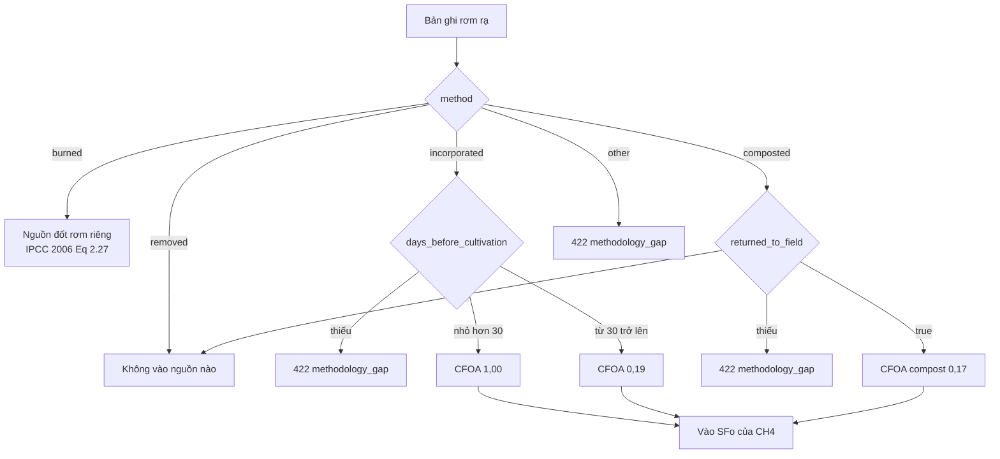

# Phương pháp tính Carbon

Trang này diễn giải **chính xác những gì code đang làm** trong
`backend/carbon/engine.py` và `backend/carbon/methodology.py`, với giá trị tham số
lấy từ `backend/config/emission_factors.yaml` (`version: 0.3.0-ipcc2019-tier1-ar5`,
`review_date: 2026-09-15`). Từng hệ số, nguồn và độ không chắc chắn:
[Sổ đăng ký hệ số](carbon-factor-register.md).

!!! warning "READY_FOR_DEMO — không phải kết quả đã thẩm định"
    Hệ số lõi VERIFIED theo IPCC có số hiệu bảng, GWP chốt AR5 GWP-100 (OI-05 đã đóng),
    engine khớp tính tay. Còn mở: chuyên gia lĩnh vực chưa thẩm định, hệ số nhiên liệu và
    lưới điện chưa có (OI-06), bộ số là IPCC Tier 1 default thay vì hệ số quốc gia (OI-02).
    Không trình bày kết quả là chứng nhận, chính thức hay MRV-compliant.

## 1. Phạm vi

- Đơn vị tính: **một Crop Season** trên một thửa.
- Activity: mọi activity chưa xoá thuộc mọi production batch chưa xoá của vụ.
- Ranh giới hệ thống **có**: CH₄ trong vụ từ ruộng ngập, N₂O trực tiếp từ phân đạm,
  CH₄ + N₂O từ đốt rơm ngoài đồng, CO₂e từ nhiên liệu (khi có hệ số).
- **Không có** (engine sinh cảnh báo): CH₄ ngoài vụ, N₂O gián tiếp (IPCC Eq 11.9/11.10),
  N từ phân hữu cơ, phát thải upstream của thuốc BVTV và giống, CO₂ từ đốt sinh khối,
  điện bơm (chưa có hệ số lưới điện).

## 2. Chốt các biến cấp vụ

### Chế độ nước trong vụ

Thứ tự ưu tiên (`mapping.resolve_water_regime`):

1. `crop_seasons.ipcc_water_regime` nếu đã khai.
2. Nếu không, suy từ `irrigation_events.method` của vụ:

| `irrigation_method` | Chế độ IPCC |
|---|---|
| `continuous_flooding` | `irrigated_continuous_flooding` |
| `awd` | `irrigated_multiple_drainage` |
| `alternate`, `other` | **Không đoán** → `422 methodology_gap` |
| Nhiều bản ghi mâu thuẫn | `409 conflicting_water_records` |

Kịch bản (`water_regime_scenario`):

| Kịch bản | Chế độ nước áp dụng |
|---|---|
| `as_recorded` | Chế độ đã ghi nhận ở trên; không có thì `422 missing_activity_data` |
| `awd` | `irrigated_multiple_drainage` |
| `continuous_flooding` | `irrigated_continuous_flooding` |

Dữ liệu ghi nhận vẫn được kiểm tra hợp lệ ngay cả khi kịch bản ghi đè.

### Số ngày canh tác `t`

`crop_seasons.cultivation_days`, hoặc `actual_harvest_date − planting_date` (ngày).
Thiếu hoặc ≤ 0 → `422 missing_activity_data`. Giá trị `default_cultivation_days = 102`
trong YAML có `status: NOT_IMPLEMENTED` và **engine không dùng**.

## 3. CH₄ từ canh tác lúa (IPCC 2019 Refinement, Vol.4, Ch.5)

```text
EFi  = EFc × SFw × SFp × SFo                         (Eq 5.2)
SFo  = (1 + Σ ROAi × CFOAi) ^ sfo_exponent            (Eq 5.3)
CH4  = EFi × cultivation_days × area_ha               (Eq 5.1)   [kg CH4]
CO2e = CH4 × GWP_CH4
```

| Thành phần | Nguồn trong code | Giá trị YAML | Trạng thái |
|---|---|---|---|
| `EFc` | `factors.ch4_rice.efc` | 1,22 kg CH₄/ha/ngày (Đông Nam Á, Table 5.11) | VERIFIED |
| `SFw` | `factors.ch4_rice.sfw.<chế độ nước>` | xem bảng dưới (Table 5.12) | VERIFIED |
| `SFp` | `factors.ch4_rice.sfp.<pre_season_water_regime>` | xem bảng dưới (Table 5.13) | VERIFIED |
| `SFo` | tính từ rơm vùi/ủ, `sfo_exponent = 0,59` (Eq 5.3) | — | VERIFIED |
| `CFOA` | `factors.ch4_rice.cfoa.*` (Table 5.14) | xem mục Rơm rạ | VERIFIED |
| `GWP_CH4` | `gwp.ch4` | 28 kg CO₂e/kg CH₄ (AR5 WG1 Table 8.A.1, GWP-100) | VERIFIED |

**SFw — chế độ nước trong vụ**

| Chế độ | SFw |
|---|---|
| `irrigated_continuous_flooding` | 1,00 |
| `irrigated_single_drainage` | 0,71 |
| `irrigated_multiple_drainage` (gồm AWD) | 0,55 |
| `rainfed_regular` | 0,54 |
| `rainfed_drought_prone` | 0,16 |
| `deep_water` | 0,06 |
| `upland` | 0,0 |

**SFp — chế độ nước trước vụ** (bắt buộc; thiếu → `422 methodology_gap`)

| `pre_season_water_regime` | SFp |
|---|---|
| `non_flooded_pre_season_lt_180d` | 1,00 |
| `non_flooded_pre_season_gt_180d` | 0,89 |
| `flooded_pre_season_gt_30d` | 2,41 |
| `non_flooded_pre_season_gt_365d` | 0,59 |

Không có chất hữu cơ nào đi vào SFo thì `SFo = (1 + 0)^0,59 = 1,0` và engine thêm
cảnh báo rằng CH₄ có thể bị tính thiếu nếu thực tế có vùi rơm mà chưa nhập.

Dòng phân rã: `source = ch4_rice_cultivation`, `activity_unit = ha_day`,
`activity_value = cultivation_days × area_ha`. `factors_used` ghi thêm
`_derived.sfo`, `_derived.ef_i_kgCH4_per_ha_day` và `_sfo_terms`.

## 4. N₂O trực tiếp từ phân bón (IPCC 2019 Refinement, Vol.4, Ch.11)

```text
kg_N   = Σ amount_kg × nitrogen_percent / 100
N2O-N  = kg_N × EF1FR                                 (Eq 11.1)
N2O    = N2O-N × 44/28                                [kg N2O]
CO2e   = N2O × GWP_N2O
```

- Hệ số áp lên **kg N**, không phải kg phân. Một lần bón thiếu `nitrogen_percent`
  → engine ném `MissingActivityDataError` trước mọi tra cứu hệ số (không tra bảng thành
  phần phân bón); API trả `422 missing_activity_data`
  ([B5](../limitations/implementation-audit-findings.md#b5), đã sửa).
- Không có bản ghi phân bón → không có dòng N₂O, kèm cảnh báo "N₂O = 0 nếu thực tế
  có bón mà chưa nhập thì đang tính thiếu". Tổng N ≤ 0 → không có dòng N₂O.

| Chế độ nước áp dụng | Khoá EF1FR | EF1FR (kg N₂O-N / kg N) |
|---|---|---|
| `irrigated_continuous_flooding` | `continuous_flooding` | 0,003 |
| `irrigated_single_drainage`, `irrigated_multiple_drainage` | `single_and_multiple_drainage` | 0,005 |
| `rainfed_regular`, `rainfed_drought_prone`, `deep_water` | `aggregate` + cảnh báo | 0,004 |
| `upland` | — | `422 methodology_gap` (cần EF1, chưa cấu hình) |

`n2o_n_to_n2o = 44/28 = 1,5714…` (hằng số hoá học). `GWP_N2O` (`gwp.n2o`) = 265
(AR5 WG1 Table 8.A.1, GWP-100).
Mỗi lần có dòng N₂O, engine thêm cảnh báo rằng N₂O gián tiếp chưa được tính.

## 5. Rơm rạ

Mỗi bản ghi `straw_management_events` đi vào **đúng một** đường
(`methodology.classify_straw`), theo chú thích a của IPCC Table 5.14 (rơm đốt không
thuộc SFo):



### Rơm vùi / ủ trả lại ruộng → SFo

```text
ROA [tấn chất khô/ha] = straw_mass_kg × dry_matter_fraction / 1000 / area_ha
```

Thiếu `straw_mass_kg` → `422 missing_activity_data`; thiếu `dry_matter_fraction`
→ `422 methodology_gap` (engine không đoán độ ẩm).

### Rơm đốt → nguồn riêng

```text
M_dm   = Σ straw_mass_kg × dry_matter_fraction        [kg chất khô]
burnt  = M_dm × Cf                                     Cf = 0,80   (IPCC 2006 Table 2.6)
CH4    = burnt × Gef_CH4 / 1000                        Gef_CH4 = 2,7 g/kg   (Table 2.5)
N2O    = burnt × Gef_N2O / 1000                        Gef_N2O = 0,07 g/kg  (Table 2.5)
CO2e   = CH4 × GWP_CH4 + N2O × GWP_N2O
```

Sinh hai dòng `source = straw_burning` (một cho CH₄, một cho N₂O). CO₂ từ đốt rơm
**không** được tính (`straw_burning.co2_counted`, PENDING_VERIFICATION).

### Chặn double counting

`engine._assert_no_double_counting` so tập phương pháp của rơm đã vào SFo với tập
phương pháp của rơm bị đốt; nếu giao nhau → `409 double_counting`. Vì
`classify_straw` đã phân mỗi bản ghi vào một đường, đây là bất biến bảo vệ ở tầng
engine chứ không phải nhánh xử lý thường gặp.

## 6. Nhiên liệu và điện

```text
CO2e_fuel = Σ(amount_liter theo fuel_type) × EF_fuel
```

`factors.fuel.diesel`, `gasoline`, `lpg` đều **null** → vụ có bất kỳ bản ghi
`fuel_usages` nào sẽ nhận `422 missing_emission_factor`. Loại `other` không có mục
trong YAML nên cũng báo thiếu hệ số. `pump_energy_kwh` của `irrigation_events` chỉ
sinh cảnh báo "chưa được tính vào tổng" (`fuel.electricity_grid` null).

Hiện chỉ Flutter ghi được `fuel_usages`; Farmer Web không có form nhiên liệu.

## 7. AWD không phải một tỷ lệ giảm cố định

Engine **không** có hằng số "AWD giảm X%". Kịch bản `awd` chạy lại toàn bộ phép tính
trên **cùng dữ liệu vụ**, chỉ đổi chế độ nước áp dụng thành
`irrigated_multiple_drainage`, và thay đổi đó tác động đồng thời lên hai khí:

| Khí | Thay đổi khi chuyển từ ngập liên tục sang AWD |
|---|---|
| CH₄ | `SFw` 1,00 → 0,55 (giảm) |
| N₂O | `EF1FR` 0,003 → 0,005 (tăng) |

Chênh lệch ròng phụ thuộc lượng đạm, rơm và các biến khác của chính vụ đó.
Recommendation dùng đúng cơ chế này (`CarbonService.calculate(..., "awd", persist=False)`)
và chỉ đưa ra khuyến nghị khi chênh lệch tổng CO₂e **dương**
(xem [Recommendation](../modules/recommendation.md)).

## 8. Mẫu số sản lượng và cường độ carbon

```text
yield_kg     = Σ harvest_events.yield_kg   (activity harvest chưa xoá, mọi lô của vụ)
co2e_per_kg  = total_co2e_kg / yield_kg     [kg CO2e / kg thóc]
```

- Không có bản ghi thu hoạch → `yield_kg = null`, `co2e_per_kg = null`, kèm cảnh báo
  "Chưa có sản lượng nên chưa tính được CO2e/kg". **Không** trả 0.
- `yield_kg ≤ 0` → `422 missing_activity_data` (DB đã chặn bằng `yield_kg > 0`).
- Một bản tính thành công vẫn hợp lệ khi chưa có sản lượng (migration
  `20260908000003`); cột `carbon_calculations.co2e_per_kg` là generated
  `total_co2e_kg / nullif(yield_kg, 0)`.

## 9. Tổng hợp và kết quả

```text
total_co2e_kg = Σ co2e_kg của mọi dòng breakdown
```

Kết quả gồm: tổng CO₂e, CO₂e/kg, phân rã theo nguồn và khí, `factors_used` +
`provenance` (trích dẫn nguồn của từng tham số) + `parameter_status`, `methodology`,
`ef_config_version`, `engine_version`, `input_hash`, `calculated_at`, `warnings`.

Khi lưu, mỗi dòng phân rã thành một hàng `carbon_breakdowns`:

| `source` + `gas` | `category` | `factor_value_used` |
|---|---|---|
| `ch4_rice_cultivation` + `ch4` | `irrigation_ch4` | `EFi` (đã nhân 4 thành phần) |
| `n2o_fertilizer_direct` + `n2o` | `fertilizer_n2o` | `EF1FR` |
| `straw_burning` + `ch4` / `n2o` | `straw_burning_ch4` / `straw_burning_n2o` | `Gef` tương ứng |
| `fuel_<loại>` | `fuel` | `EF_fuel` |

`formula_metadata` lưu `factors_used`, `derived`, `sfo_terms`, `provenance`,
`parameter_status`, `primary_factor_code` để tái hiện phép tính.

## 10. Cảnh báo engine tự sinh

| Điều kiện | Nội dung cảnh báo (tóm tắt) |
|---|---|
| Không có bản ghi rơm | SFo = 1,0; CH₄ có thể bị tính thiếu |
| Không có bản ghi phân bón | N₂O = 0; có thể bị tính thiếu |
| Có thuốc BVTV / giống | Phát thải upstream ngoài ranh giới hệ thống |
| Luôn luôn | CH₄ ngoài vụ không được tính |
| Có dòng N₂O | N₂O gián tiếp chưa được tính |
| Chế độ nước rainfed/deep water | EF1FR dùng giá trị gộp, độ không chắc chắn cao |
| Có điện bơm | Điện chưa có hệ số, không vào tổng |
| Chưa có sản lượng | Chưa tính được CO₂e/kg |
| Tham số không `VERIFIED` hoặc thiếu nguồn | "Kết quả không dùng được cho báo cáo chính thức" |
| `methodology.tier = 1` | Đang dùng IPCC Tier 1 default, không được gắn nhãn MRV-compliant |

## 10a. Kiểm tra tính tay

Vụ 1 ha, 100 ngày, ngập liên tục, không ngập <180 ngày trước vụ, không bổ sung hữu cơ, urea
100 kg (46% N), 6.000 kg thóc:

```text
CH4   = 1,22 × 1,00 × 1,00 × 1,0 × 100 × 1        = 122,0 kg      × 28  = 3.416,0 kg CO2e
N2O   = 46 kg N × 0,003 × 44/28                   = 0,2168571 kg  × 265 =    57,4671 kg CO2e
Tổng                                                                   = 3.473,4671 kg CO2e
CO2e/kg thóc = 3.473,4671 / 6.000                                      = 0,5789112
AWD: CH4 1,22 × 0,55 × 100 = 67,1 kg → 1.878,8; N2O 46 × 0,005 × 44/28 → 95,7786
     tổng 1.974,5786 (giảm 43,15%: CH4 giảm, N2O tăng — không phải tỷ lệ phẳng)
```

`backend/tests/test_carbon_real_factors.py` so engine với các số trên (và rơm vùi, rơm đốt)
bằng file tham số thật. Trên hosted dev, `hosted_carbon_factor_smoke.py` thêm 2.000 kg rơm
đốt (tổng 3.601,5111; AWD 2.102,6226) và khớp qua API, bảng breakdown và gói MRV.

## 11. Tính tái lập

`input_hash = SHA-256(CropActivityData.canonical_json() | scenario | ef_config_version | ENGINE_VERSION)`.
Cùng dữ liệu, kịch bản và phiên bản tham số cho cùng hash; DB có unique index
`(crop_season_id, scenario, factor_set_id, input_hash)` cho bản tính cả vụ; tính lại
với cùng hash trả lại bản tính đã lưu.

## 12. Hạn chế khoa học còn mở

| Mã | Nội dung | Ảnh hưởng |
|---|---|---|
| OI-05 | **Đã đóng 2026-09-15:** AR5 GWP-100 (CH₄ 28, N₂O 265) theo UNFCCC 18/CMA.1 | Engine ra số CO₂e |
| — | Chuyên gia lĩnh vực chưa thẩm định bộ hệ số | Mức sẵn sàng dừng ở READY_FOR_DEMO |
| — | Hệ số Tier 2 theo vùng/mùa vụ của QĐ 2626 chưa dùng (engine Tier 1 theo chế độ nước) | Chưa phản ánh điều kiện Việt Nam |
| OI-02 | Chưa có toàn văn + phụ lục QĐ 4801/QĐ-BNNMT; đang dùng IPCC Tier 1 | Không được gọi là MRV-compliant |
| OI-06 | Chưa có hệ số diesel/xăng/LPG và lưới điện Việt Nam | Vụ có nhiên liệu không tính được; điện bơm bị loại |
| OI-01 | Giá trị tham chiếu 1,04 kg CO₂/kg và 2,29–3,72 kg CO₂e/kg mâu thuẫn | Không dùng làm benchmark (engine không đọc mục này) |
| OI-03 | Chưa đối chiếu kết quả với FarMoRe trên cùng lô | Chưa có kiểm chứng chéo |
| — | `straw_burning.co2_counted` chưa xác nhận | CO₂ từ đốt rơm đang bị loại |
| — | Dữ liệu `pre_season_water_regime`, `dry_matter_fraction`, `days_before_cultivation` không suy được từ dữ liệu cũ | Phải thu thập trực tiếp |

Nguồn đầy đủ của từng tham số: `docs/CARBON_METHOD.md` và
`docs/CARBON_METHOD_SOURCES.md` trong repository.
