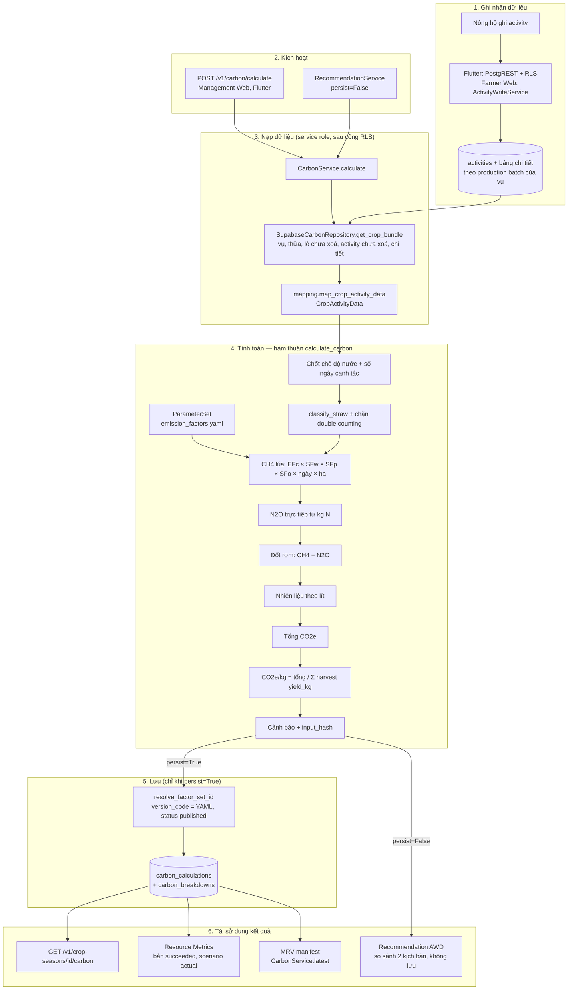

# Carbon Engine

!!! danger "Trạng thái sẵn sàng"
    **ENGINEERING READY — SCIENTIFIC PRODUCTION READINESS NOT COMPLETE.**

    - `gwp.ch4`, `gwp.n2o` và toàn bộ `factors.fuel.*` đang `value: null`,
      `status: PENDING_VERIFICATION` trong `backend/config/emission_factors.yaml`.
    - Vì mọi bản tính đều có dòng CH₄ cần GWP, **mọi lần tính CO₂e với cấu hình
      hiện tại dừng ở `422 missing_emission_factor`** (sau khi dữ liệu vụ đã được
      kiểm tra). `GET /health` báo `carbon_production_ready: false`, `mrv_compliant: false`.
    - Bộ tham số là **IPCC Tier 1 default**, không phải hệ số đặc trưng quốc gia;
      toàn văn QĐ 4801/QĐ-BNNMT chưa được lấy (OI-02).
    - Kết quả không được trình bày là chứng nhận, số liệu chính thức hay MRV-compliant.

Công thức chi tiết: [Phương pháp tính Carbon](../methodology/carbon-calculation.md).

## Phạm vi

Một bản tính thuộc về **một Crop Season**. Diện tích lấy từ thửa của vụ, số ngày
canh tác lấy từ vụ, và activity được gom từ **mọi production batch chưa xoá** của
vụ. Production batch không phải phạm vi tính (xem
[Quyết định thiết kế](../architecture/design-decisions.md#1-pham-vi-carbon-crop-season)).

## Thành phần

| Thành phần | File | Vai trò |
|---|---|---|
| Model đầu vào | `backend/carbon/models.py` | `CropActivityData`, `FertilizerApplication`, `StrawEvent`, `FuelUsage`, `IrrigationEvent`, `Harvest`...; hằng `WATER_REGIMES`, `SCENARIOS`, `SCENARIO_TO_DB` |
| Bộ tham số | `backend/carbon/factors.py` | `ParameterSet.load()` đọc YAML; `get()` ném `MissingEmissionFactorError` khi thiếu hoặc `value: null` — không có giá trị mặc định |
| Phương pháp luận | `backend/carbon/methodology.py` | `classify_straw`, `RiceMethaneCalculator`, `FertilizerN2OCalculator`, `StrawBurningCalculator`, `FuelEmissionCalculator` |
| Điều phối | `backend/carbon/engine.py` | `calculate_carbon()`, kiểm tra, tổng hợp, cảnh báo, `compute_input_hash()`; `ENGINE_VERSION = "0.2.0"` |
| Lỗi | `backend/carbon/errors.py` | `CarbonEngineError` và các lớp con |
| Ánh xạ DB | `backend/infrastructure/mapping.py` | Hàng Supabase → `CropActivityData`; kết quả → hàng `carbon_calculations`/`carbon_breakdowns` |
| Repository | `backend/infrastructure/supabase_repo.py` | `SupabaseCarbonRepository` (service role) |
| Service | `backend/service.py` | `CarbonService.calculate(crop_season_id, scenario, persist=True)`, `latest()` |
| Route | `backend/api.py` | `POST /v1/carbon/calculate`, `GET /v1/crop-seasons/{id}/carbon`, `GET /v1/carbon/scenarios` |

Package `carbon/` chỉ phụ thuộc thư viện chuẩn và `pyyaml`; nó không biết tới
FastAPI, Supabase hay UI.

## Input thực sự được dùng

| Input | Nguồn trong DB | Dùng cho | Thiếu thì |
|---|---|---|---|
| Diện tích `area_ha` | `plots.area_ha` | CH₄ (Eq 5.1), ROA của rơm | `422 missing_activity_data` |
| Số ngày canh tác | `crop_seasons.cultivation_days`, hoặc `actual_harvest_date − planting_date` | CH₄ (Eq 5.1) | `422 missing_activity_data` (không dùng mặc định vùng 102 ngày) |
| Chế độ nước trong vụ | `crop_seasons.ipcc_water_regime`, hoặc suy từ `irrigation_events.method` | SFw, khoá EF1FR | `as_recorded`: `422 missing_activity_data` |
| Chế độ nước trước vụ | `crop_seasons.pre_season_water_regime` | SFp | `422 methodology_gap` |
| Phân bón | `fertilizer_applications.amount_kg`, `nitrogen_percent` | N₂O trực tiếp | Thiếu `nitrogen_percent`: `ValidationError` gốc → hiện rơi vào `500 internal_error` (xem [B5](../limitations/implementation-audit-findings.md#b5)) |
| Rơm rạ | `straw_management_events.method`, `straw_mass_kg`, `dry_matter_fraction`, `days_before_cultivation`, `returned_to_field` | SFo hoặc nguồn đốt rơm | `422 methodology_gap` / `missing_activity_data` |
| Nhiên liệu | `fuel_usages.fuel_type`, `amount_liter` | Nguồn nhiên liệu | Hệ số null → `422 missing_emission_factor` |
| Điện bơm | `irrigation_events.pump_energy_kwh` | Chỉ sinh **cảnh báo**, không cộng vào tổng | — |
| Sản lượng | Tổng `harvest_events.yield_kg` | Mẫu số CO₂e/kg | `co2e_per_kg = null` + cảnh báo |
| Thuốc BVTV, giống | `pesticide_applications`, `seeding_events` | Chỉ cảnh báo "ngoài ranh giới hệ thống" | — |

## Output

`POST /v1/carbon/calculate` trả `CarbonResult.to_dict()` cộng ba trường tương thích:

| Trường | Ý nghĩa |
|---|---|
| `crop_season_id`, `scenario`, `water_regime_scenario` | Vụ và kịch bản đã yêu cầu |
| `water_regime_applied` | Chế độ nước IPCC thực sự áp (kịch bản `awd`/`continuous_flooding` là giả định) |
| `total_co2e_kg` (= `co2e_total_kg`) | Tổng CO₂e của mọi dòng phân rã |
| `yield_kg`, `co2e_per_kg` | Tổng sản lượng; `total / yield` hoặc `null` |
| `breakdown[]` | `source`, `gas`, `activity_value`, `activity_unit`, `gas_kg`, `co2e_kg`, `formula`, `factors_used`, `provenance`, `parameter_status` |
| `methodology` | `{name, version, tier}` từ YAML |
| `ef_config_version` | `version` của YAML (hiện `0.2.0-ipcc-tier1`) |
| `engine_version` | `0.2.0` |
| `input_hash` | SHA-256 của (dữ liệu đầu vào chuẩn hoá, kịch bản, phiên bản tham số, phiên bản engine) |
| `calculated_at` | Thời điểm tính (UTC ISO-8601) |
| `warnings[]` | Cảnh báo dạng chuỗi |
| `calculation_id` | Id hàng `carbon_calculations` đã lưu |

`GET /v1/crop-seasons/{id}/carbon` trả **hàng đã lưu** (các cột của
`carbon_calculations` + `breakdown` là các hàng `carbon_breakdowns`), nên hình dạng
khác response của `POST`. Chỉ trả bản tính `succeeded` mới nhất, lọc theo `scenario`
nếu có.

## Luồng tính toán, lưu và tái sử dụng

| Việc | Diễn ra ở đâu |
|---|---|
| **Tính toán** | `carbon/engine.py::calculate_carbon` + `carbon/methodology.py` (thuần, không I/O) |
| **Lưu** | `SupabaseCarbonRepository.save_calculation` — `carbon_calculations` (`status = succeeded`, `mrv_compliant = false`, `production_batch_id` null) + `carbon_breakdowns` |
| **Tái sử dụng** | Metrics đọc thẳng bảng `carbon_calculations`; Recommendation gọi lại `CarbonService.calculate(persist=False)`; MRV gọi `CarbonService.latest()` |

## Ánh xạ lỗi sang HTTP

| Lỗi | HTTP | `code` |
|---|---|---|
| Không đọc được vụ qua RLS / vụ không tồn tại | 404 | `crop_not_found` |
| `InvalidWaterRegimeError` | 400 | `invalid_water_regime` |
| `ConflictingWaterRegimeError` | 409 | `conflicting_water_records` |
| `DoubleCountingError` | 409 | `double_counting` |
| `MissingEmissionFactorError` | 422 | `missing_emission_factor` |
| `MethodologyGapError` | 422 | `methodology_gap` |
| `MissingActivityDataError` | 422 | `missing_activity_data` |
| `FactorSetNotFoundError` | 503 | `factor_set_not_imported` |
| Lỗi khác | 500 | `internal_error` (kèm `request_id`, không lộ stack trace) |

Lỗi thiếu `nitrogen_percent` là `ValidationError` gốc (không phải lớp con trong
bảng trên), nên rơi vào nhánh `500 internal_error`. Với YAML hiện tại lỗi này chưa
lộ ra vì dòng CH₄ (tính trước N₂O) đã dừng ở GWP; nó sẽ xuất hiện khi GWP có giá
trị — xem [Giới hạn](../limitations/current-limitations.md).

## Dữ liệu cần import trước khi lưu được

Giá trị hệ số lấy từ YAML, nhưng để **lưu** bản tính, database phải có một
`emission_factor_sets` với `version_code = "0.2.0-ipcc-tier1"` và `status = published`,
cùng các `emission_factors.factor_code` khớp đường dẫn YAML (bỏ tiền tố `factors.`,
ví dụ `ch4_rice.efc`, `n2o_fertilizer.ef1fr.continuous_flooding`). Theo migration
`20260913120000`, hosted dev tại thời điểm đó có 0 hàng `emission_factor_sets`.
