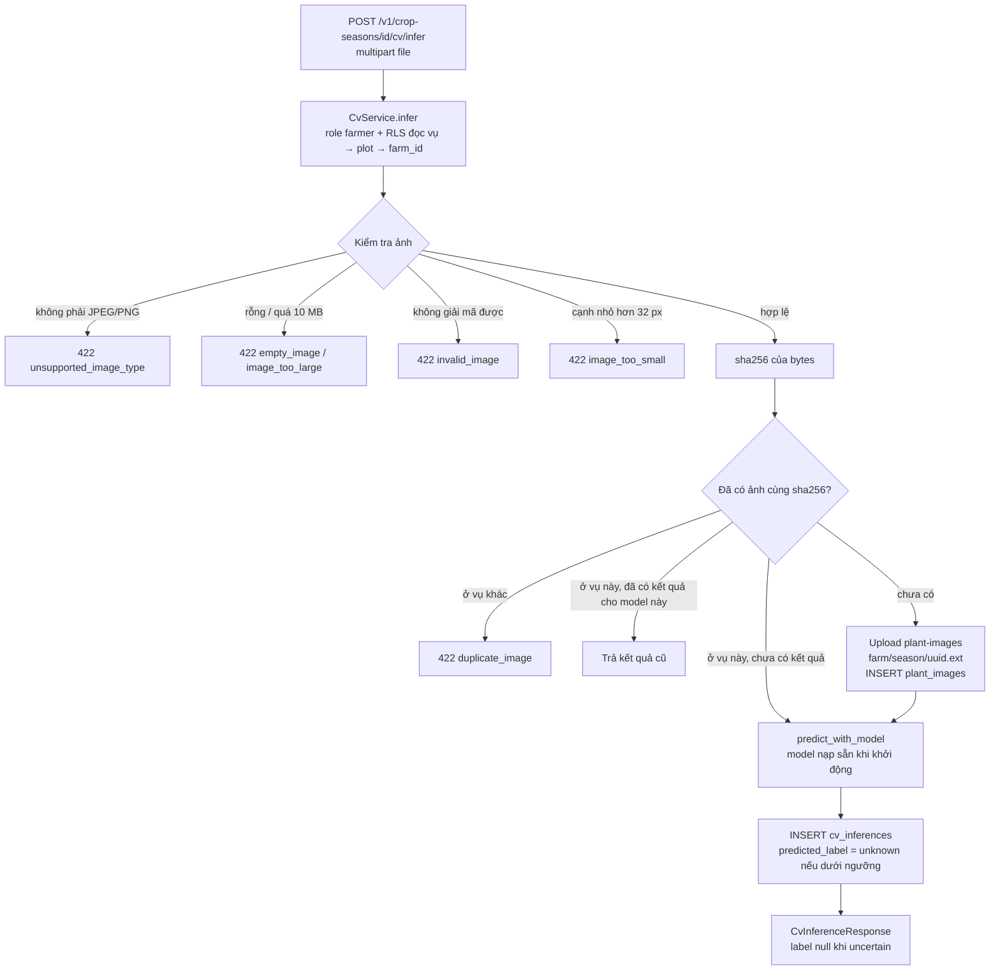

# Computer Vision

!!! warning "EXPERIMENTAL — NOT FIELD VALIDATED"
    Mô hình nhận diện bệnh lá lúa là **baseline thử nghiệm** huấn luyện trên dataset
    công khai. Chưa có ảnh thực địa từ HTX pilot, chưa đánh giá trên ảnh nông hộ chụp
    ngoài đồng, và **không** có khả năng từ chối ảnh không phải lá lúa một cách đáng
    tin cậy. Kết quả chỉ để **hỗ trợ**, không thay thế chẩn đoán chuyên môn.

## Mô hình

Nguồn: `ml/reports/cv_baseline_report.md`, `ml/model.py`, `ml/infer.py`.

| Mục | Giá trị |
|---|---|
| Bài toán | Phân loại 4 lớp: `rice_blast` (đạo ôn), `bacterial_leaf_blight` (bạc lá), `brown_spot` (đốm nâu), `healthy` (lá khoẻ) |
| Dataset | Rice Leaf Bacterial and Fungal Disease Dataset (Mendeley, DOI 10.17632/hx6f852hw4.2), chỉ "Original Images", 4/8 lớp, CC BY 4.0 |
| Chia dữ liệu | Train 608 · Validation 132 · Test 125; phân tầng theo lớp, gom ảnh gần trùng (aHash Hamming ≤ 5) vào cùng một tập, seed 42 |
| Kiến trúc | MobileNetV2 pretrained ImageNet, fine-tune toàn bộ, head tuyến tính; ảnh 224 px; CPU |
| Accuracy trên test | 85,60 % (macro F1 0,8602) |
| Hiệu chỉnh | Temperature scaling, T = 1,65 (tối thiểu NLL trên validation) |
| Ngưỡng tin cậy | 0,939849 (tối ưu Youden's J trên validation) |
| Tỷ lệ "không chắc chắn" trên test | 42,40 % |
| `version_code` | `mobilenetv2-baseline-20260909-222933` |

| Lớp | Precision | Recall | F1 | Support |
|---|---|---|---|---|
| rice_blast | 0,9118 | 0,8378 | 0,8732 | 37 |
| bacterial_leaf_blight | 0,8621 | 0,9259 | 0,8929 | 27 |
| brown_spot | 0,7949 | 0,8158 | 0,8052 | 38 |
| healthy | 0,8696 | 0,8696 | 0,8696 | 23 |

Tỷ lệ uncertain cao là hệ quả thật của baseline: mô hình tự tin quá mức ngay cả khi
sai, nên ngưỡng tối ưu phải cao.

## Suy luận

```text
tensor      = eval_transform(ảnh RGB, 224 px)
probs       = softmax(logits / T)
confidence  = max(probs)
uncertain   = confidence < threshold
label       = null nếu uncertain, ngược lại nhãn có xác suất lớn nhất
```

`predict_with_model` là **đường tiền xử lý duy nhất**, dùng chung cho CLI, test ML
và backend.

## Tích hợp backend



| Hành vi | Code |
|---|---|
| Nạp mô hình **một lần** khi process khởi động từ run mới nhất trong `ml/runs/` | `main.py::_build_cv_service` |
| Thiếu / hỏng checkpoint → route CV trả `503 backend_not_configured`, phần còn lại của API vẫn chạy | `main.py` |
| Metadata mô hình lấy từ `eval_metrics.json`; `cv_model_versions` được tạo với `status = 'draft'` | `PostgresCvRepository.get_or_create_model_version` |
| DB không có trạng thái null cho nhãn: dưới ngưỡng lưu `unknown`, API trả `label: null`, `uncertain: true` | `CvService.infer`, `_to_response` |
| `is_uncertain` là cột generated `confidence < threshold_used` | migration baseline |
| Nhãn tiếng Việt `label_vi` lấy từ `ml/class_mapping.py::LABEL_VI` | `CvService._to_response` |

| Route | Quyền |
|---|---|
| `POST /v1/crop-seasons/{id}/cv/infer` | role `farmer` + đọc được vụ |
| `GET /v1/crop-seasons/{id}/cv/inferences` | đọc được vụ |
| `GET /v1/cv/inferences/{id}` | đọc được vụ của ảnh |

## Giao diện

- **Farmer Web** (`src/farmer/CvCheck.tsx`): nút "Kiểm tra lá lúa", xem kết quả và
  lịch sử "Kiểm tra gần đây" với ghi chú "Kết quả hỗ trợ nhận diện từ mô hình AI —
  chưa xác nhận thực địa". Kết quả dưới ngưỡng hiển thị "Chưa chắc chắn" và gợi ý
  chụp/chọn ảnh khác, không ép một nhãn bệnh.
- **Flutter**: màn chụp ảnh lá tồn tại nhưng dùng `UnavailableCvInferenceService`
  (báo "chưa cấu hình"); chưa gọi route CV của backend.
- **Management Web**: không có màn CV.

## Giới hạn

| Giới hạn | Chi tiết |
|---|---|
| Chưa xác thực thực địa | Ảnh dataset chụp bán kiểm soát (Bangladesh, 2023); khác biệt miền với ảnh điện thoại tại ĐBSCL |
| OOD / ảnh không phải lá lúa | Mô hình 4 lớp vẫn có thể gán một trong 4 nhãn nếu độ tin cậy đủ cao; ngưỡng chỉ giảm rủi ro. **Chưa có benchmark cho ảnh không phải lúa hoặc ảnh xấu** |
| Quá tự tin | Dự đoán sai vẫn thường có độ tin cậy cao; tỷ lệ uncertain 42 % trên test |
| Quy mô dữ liệu | 608 ảnh train, 4 lớp; bệnh khác của lúa nằm ngoài phạm vi |
| Artifact | `ml/runs/` không được git track; triển khai phải cung cấp checkpoint riêng |
| Trạng thái model | `cv_model_versions.status = draft`, chưa được đánh dấu `active` |
| Trùng ảnh | `plant_images.sha256` unique toàn cục: cùng một ảnh không dùng được cho hai vụ |
