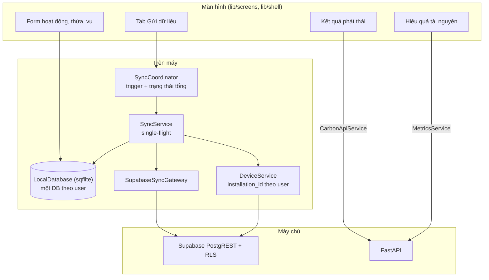
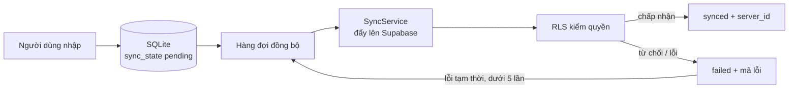
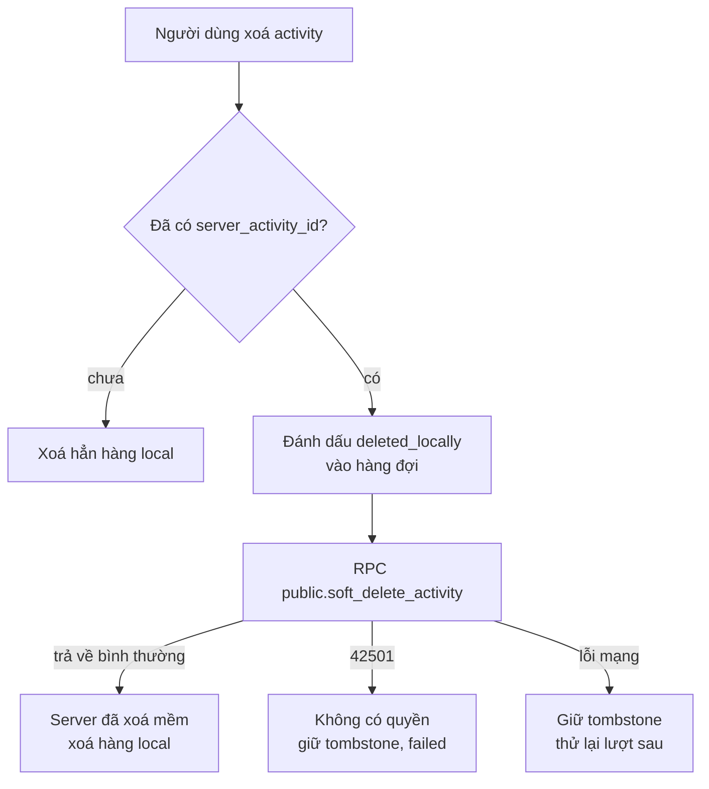

# Flutter Mobile

Ứng dụng Flutter cho nông hộ, thiết kế **offline-first**: mọi thao tác nhập ghi
vào SQLite trên máy trước, rồi được đồng bộ **thẳng vào Supabase** qua PostgREST
dưới RLS. Backend FastAPI chỉ được gọi cho những gì cần tính toán hoặc tổng hợp.

!!! warning "Trạng thái phát hành"
    - Bản `release` Android hiện **ký bằng khoá debug**
      (`app/android/app/build.gradle.kts`: `signingConfig = signingConfigs.getByName("debug")`,
      không có `key.properties`). **Chưa có production release signing.**
    - iOS chưa được build (cần macOS + Xcode + Apple signing).
    - `integration_test/` cần thiết bị hoặc emulator.
    - Khuyến nghị và Computer Vision **chưa được nối** vào backend trong Flutter.

## Kiến trúc

| Thành phần | File |
|---|---|
| Cấu hình `--dart-define` | `lib/config.dart` |
| Khởi tạo dịch vụ | `lib/app_services.dart`, `lib/main.dart` |
| SQLite | `lib/db/local_database.dart` (`schemaVersion = 5`) |
| Trạng thái đồng bộ | `lib/models/sync_state.dart`, `lib/models/sync_queue_item.dart` |
| Đẩy / kéo dữ liệu | `lib/services/sync_service.dart`, `sync_gateway.dart` |
| Điều phối | `lib/services/sync_coordinator.dart` |
| Phân loại lỗi | `lib/services/sync_errors.dart` |
| Thiết bị | `lib/services/device_service.dart` |
| Gọi FastAPI | `carbon_api_service.dart`, `read_api.dart`, `metrics_service.dart`, `me_service.dart` |

## Luồng thực tế

### SQLite local

Bảng: `farms`, `plots`, `crop_seasons`, `activities`, `active_context`, `meta`.
Trạng thái đồng bộ nằm **ngay trên từng bảng** (không có bảng queue riêng):

| `sync_state` | Ý nghĩa |
|---|---|
| `pending` | Chưa gửi, hoặc được đưa lại để thử lại |
| `syncing` | Đang gửi; khi mở DB, mọi hàng `syncing` bị đưa về `pending` (app tắt giữa chừng) |
| `synced` | Server đã nhận, đã có `server_id` / `server_activity_id` |
| `failed` | Gửi lỗi, lưu mã lỗi (`sync_error_code` / `sync_error`) và `retry_count` |

Hàng `activities` local có thêm `payload_json`, `deleted_locally` (tombstone),
`retry_count`, `last_attempt_at`, `synced_at`.

### Cổng thử lại

Hàng đợi chọn một bản ghi khi `sync_state = pending`, **hoặc** `failed` với mã lỗi
tạm thời **và** `retry_count < 5` (`kMaxSyncAttempts`).

| `SyncErrorKind` | Nhận diện | Tự thử lại |
|---|---|---|
| `network` | Socket/timeout/host lookup | Có |
| `notConfirmed` | Server không xác nhận đã ghi | Có |
| `unknown` | Lỗi khác | Có (có trần) |
| `rlsDenied` | Postgres `42501`, "row-level security", "permission denied" | Không — cần liên hệ quản lý HTX |
| `auth` | `PGRST3xx`, lỗi JWT | Không — trạng thái `authExpired` |
| `duplicate` | `23505` | Không |
| `validation` | `23xxx`, `22P02` | Không |

### Trigger và trạng thái tổng

`SyncCoordinator` chạy một lượt đồng bộ (single-flight) khi: đăng nhập, app trở lại
foreground, có mạng lại (debounce 2 giây), hoặc người dùng bấm gửi thủ công. Tuỳ chọn
**"Chỉ Wi-Fi"** (`meta.sync.wifi_only`) chặn lượt tự động trên dữ liệu di động; lượt thủ
công có thể bỏ qua sau khi người dùng xác nhận.

Trạng thái tổng: `offline`, `idle`, `syncing`, `partialSuccess`, `allSynced`,
`failed`, `authExpired`.

### Thứ tự đẩy

1. **Plots** — upsert theo `(farm_id, plot_code)`.
2. **Crop seasons** — upsert theo `(plot_id, season_code)`; thửa cha chưa có
   `server_id` thì hoãn lượt sau (`deferred`, không tính là lỗi).
3. **Production batch mặc định** — upsert `batch_code = 'default'` cho vụ (nông hộ
   không thao tác khái niệm lô).
4. **Activities** — tìm theo `(device_id, client_event_id)`: có thì UPDATE theo `id`,
   chưa có thì INSERT. Không dùng `ON CONFLICT` vì unique index là partial. Nếu
   INSERT gặp `23505` (một lượt khác vừa chèn), đọc lại hàng đó rồi UPDATE.
5. **Bảng chi tiết** — upsert theo `activity_id`, gửi **đủ mọi cột** của loại đó; cột
   bỏ trống gửi `null` để xoá giá trị cũ trên server.

Kéo dữ liệu (`pullFarmsPlotsSeasons`): đọc toàn bộ `farms`, `plots`, `crop_seasons`
mà RLS cho phép, thay farm local, merge thửa/vụ; thửa/vụ đã đồng bộ mà server không
còn trả về sẽ bị gỡ khỏi cache. Hàng local chưa đồng bộ không bị đụng.

### Idempotency: `(device_id, client_event_id)`

- `client_event_id` = id UUID của activity local.
- `device_id` = `devices.id` trên Supabase. `installation_id` được sinh **theo từng
  user**: `uuidv5(namespace, device_seed:user_id)`, vì `devices.installation_id` là
  unique toàn bảng và RLS chỉ cho user thao tác thiết bị của chính mình.
- Unique index `activities_device_event_uidx` bảo đảm gửi lại không tạo bản trùng.
- Trigger `enforce_activity_ownership_immutable_trg` không cho client đổi `device_id`
  / `client_event_id` đã có.

### Trường ghi lên `activities`

| Cột | Giá trị |
|---|---|
| `production_batch_id` | Lô `default` của vụ |
| `activity_type` | Loại activity |
| `occurred_at` | `occurredAt.toUtc().toIso8601String()` |
| `recorded_at` | `createdAt.toUtc().toIso8601String()` |
| `source` | `mobile_offline` |
| `recorded_by` | `auth.uid()` của phiên hiện tại; không có phiên thì **không gửi**, đánh dấu `failed` (`auth`) |
| `device_id`, `client_event_id` | Khoá idempotency |
| `note` | Luôn gửi, kể cả `null` |

**Múi giờ:** `DateTime` trên máy là giờ địa phương; `toIso8601String()` của giá trị
local không có offset và Postgres sẽ hiểu là UTC (lệch ngày canh tác). Code gọi
`.toUtc()` trước khi gửi và tầng hiển thị gọi `.toLocal()`.

### Xoá mềm

Không dùng `update activities set deleted_at = ...` vì policy `activities_select`
(yêu cầu `deleted_at is null`) cũng áp lên hàng mới của UPDATE, khiến client luôn
nhận `42501`. RPC chỉ cho xoá khi người gọi là `recorded_by` và ghi được lô; gọi lại
nhiều lần vẫn trả thành công.

## Loại activity trong Flutter

`seeding`, `fertilizer`, `irrigation`, `pesticide`, `fuel`, `straw_management`,
`harvest` — cột lấy từ `lib/models/activity_field_spec.dart`, khớp tên cột migration.
Flutter là client duy nhất ghi được `fuel_usages`.

## Gọi FastAPI

| Chức năng | Endpoint |
|---|---|
| Danh sách kịch bản | `GET /v1/carbon/scenarios` (không cần auth; lỗi thì dùng 3 giá trị mặc định) |
| Tính Carbon | `POST /v1/carbon/calculate` |
| Bản tính mới nhất | `GET /v1/crop-seasons/{id}/carbon` |
| Trạng thái backend | `GET /health` |
| Chỉ số tài nguyên | `GET /v1/crop-seasons/{id}/metrics` |
| Hồ sơ | `GET /v1/me` |

## Chưa nối

| Tính năng | Hiện trạng trong code |
|---|---|
| Khuyến nghị | `UnavailableRecommendationRepository` — UI báo "chưa được cấu hình", không hiển thị khuyến nghị giả. Model Flutter vẫn mô tả hình dạng cũ (`co2e_reduction_kg`, `cost_saving_vnd`) khác `RecommendationResponse` của backend |
| Computer Vision | `UnavailableCvInferenceService` — màn hình chụp lá báo "chưa cấu hình". Enum Flutter dùng nhãn `blast`, `bacterial_blight`, `brown_spot`, `healthy`, khác nhãn backend `rice_blast`, `bacterial_leaf_blight`; ngưỡng hiển thị `0,70` của app khác ngưỡng mô hình `0,939849` |
