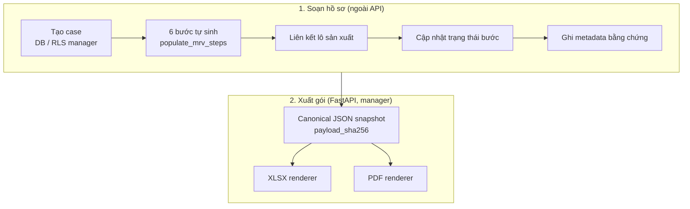
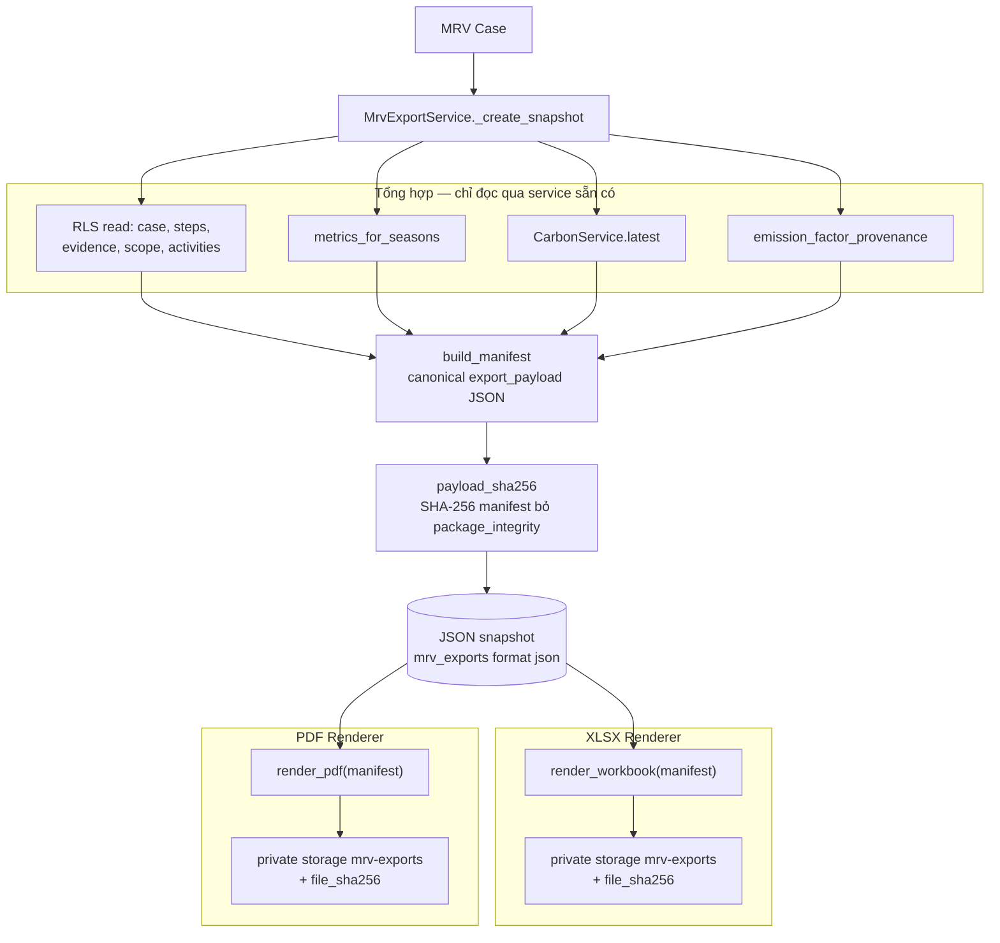
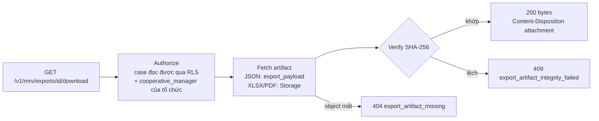

# MRV

Module MRV số hoá **hồ sơ** theo quy trình 6 bước và đóng gói hồ sơ đó thành gói
bằng chứng có thể kiểm tra toàn vẹn.

!!! danger "Gói xuất không phải chứng nhận"
    Gói MRV JSON/XLSX/PDF là **snapshot dữ liệu và bằng chứng hỗ trợ**. Nó **không**
    phải chứng nhận, thẩm định, xác nhận của cơ quan có thẩm quyền, chứng chỉ tín chỉ
    carbon hay tuyên bố tuân thủ bất kỳ tiêu chuẩn MRV nào. Mọi gói mang nguyên văn
    disclaimer sau (`mrv/manifest.py::DISCLAIMER`):

    > Gói dữ liệu MRV do hệ thống tạo từ dữ liệu hiện có. Đây KHÔNG phải chứng nhận,
    > thẩm định hay xác nhận của cơ quan có thẩm quyền, và không khẳng định tuân thủ
    > bất kỳ tiêu chuẩn MRV nào. Nội dung có thể chứa cảnh báo về bằng chứng hoặc hệ
    > số phát thải chưa đầy đủ.

    Backend luôn ghi `is_finalized = false`; cột `carbon_calculations.mrv_compliant`
    không được xuất ra gói.

## Khái niệm

| Khái niệm | Bảng | Ghi chú đối chiếu code |
|---|---|---|
| **Case** — hồ sơ MRV của một tổ chức trong một kỳ | `mrv_cases` | `status` ∈ `draft`, `in_progress`, `ready_for_verification`, `verified`, `closed` là giá trị lưu trong DB, không phải kết luận của AgriCarbon |
| **Steps** — 6 bước | `mrv_step_catalog`, `mrv_case_steps` | Trigger tạo đủ 6 dòng khi thêm case; API luôn trả 6 bước, bước chưa có dòng là `not_started`. Nhãn API: Chuẩn bị · Đăng ký · Thiết lập đường cơ sở · Đo đạc · Báo cáo · Thẩm định |
| **Batch traceability** | `mrv_case_batches` | Case liên kết production batch → vụ → thửa → nông hộ. Carbon **vẫn** tính theo vụ |
| **Evidence** | `mrv_evidence` | Chỉ **metadata** (loại, tên tệp, MIME, `sha256`, người tải). API không trả signed URL |
| **Export** | `mrv_exports`, `mrv_export_calculations` | Snapshot JSON và các bản render XLSX/PDF |

!!! note "Không có API tạo hồ sơ"
    FastAPI **không** có route tạo/sửa case, bước hay upload bằng chứng. RLS cho phép
    `cooperative_manager` ghi các bảng này trực tiếp qua PostgREST, và script
    `backend/scripts/seed_demo_data.py` tạo dữ liệu demo; không ứng dụng khách nào
    trong repo có màn hình soạn hồ sơ MRV. Bucket `mrv-evidence` có policy nhưng chưa
    có luồng upload.

## Quy trình

## JSON là snapshot chuẩn, XLSX/PDF là renderer

| | JSON | XLSX | PDF |
|---|---|---|---|
| Vai trò | **Canonical snapshot** | Renderer của một snapshot | Renderer của một snapshot |
| Nội dung dựng từ | Dữ liệu sống (qua repository/service sẵn có) | **Chỉ** `export_payload` của snapshot | **Chỉ** `export_payload` của snapshot |
| Tính lại Carbon / Resource | Không — đọc `CarbonService.latest` và `metrics_for_seasons` | Không | Không |
| Lưu bytes ở | `mrv_exports.export_payload` (không ghi object) | Bucket riêng tư `mrv-exports` | Bucket riêng tư `mrv-exports` |
| `source_snapshot_export_id` | `null` (bắt buộc) | Id snapshot JSON (bắt buộc) | Id snapshot JSON (bắt buộc) |
| Thư viện | `mrv/manifest.py` | `mrv/workbook.py` (openpyxl) | `mrv/report_pdf.py` (ReportLab, font Be Vietnam Pro) |

XLSX và PDF của cùng một snapshot là **anh em**: không cái nào render từ cái kia.
Ràng buộc `mrv_export_snapshot_lineage_chk` ngăn "snapshot của snapshot".

## Kiến trúc xuất gói

## Nội dung manifest (schema `1.0`)

| Khoá | Nội dung |
|---|---|
| `schema_version`, `export_id`, `generated_at`, `generated_by` | Định danh gói; `generated_by` chỉ gồm `user_id` và `roles` |
| `disclaimer` | Nguyên văn disclaimer |
| `case`, `scope` | Case và phạm vi: tổ chức → nông hộ → thửa → vụ → lô |
| `readiness` | Số bước đã xong/còn lại, số bằng chứng, bước chưa có bằng chứng, `carbon_available` — **đếm trạng thái thật, không có điểm số** |
| `steps`, `evidence` | 6 bước kèm số bằng chứng; bằng chứng chỉ là tham chiếu (`included_in_package = false`) |
| `activities` | Activity chưa xoá kèm chi tiết, `source`, `recorded_by`, `device_id`, `client_event_id` |
| `harvest` | Sự kiện thu hoạch — mẫu số duy nhất |
| `resource_metrics` | Theo vụ, nguyên giá trị từ service metrics |
| `carbon` | Theo vụ: bản tính đã lưu hoặc `status: unavailable` |
| `provenance` | Bộ hệ số và từng hệ số, bảng nguồn activity, `carbon_scope = crop_season`, `evidence_binaries_included = false` |
| `warnings` | Danh sách `{code, severity, message, related}` |
| `package_integrity` | `algorithm = sha256`, `canonical_over = manifest-without-package_integrity`, `canonical_form`, `manifest_sha256` |

Quy tắc canonical: khoá sắp xếp mọi cấp, separator `(',', ':')`, UTF-8 giữ nguyên ký
tự Việt, thời điểm chuẩn hoá UTC `...Z`, số lượng từ cột `numeric` xuất dưới dạng
**chuỗi** giữ nguyên độ chính xác. `null` không bao giờ thành `0`.

Mã cảnh báo trong code (`WarningCode` + cảnh báo chuyển tiếp từ engine):
`carbon_unavailable`, `factor_provenance_unavailable`, `factor_unverified`,
`evidence_none`, `evidence_checksum_missing`, `evidence_missing_for_step`,
`mrv_step_incomplete`, `resource_metric_incomplete`, `harvest_missing`,
`scope_empty`, `carbon_engine_warning`. Mức độ chỉ là `info` hoặc `warning`.

Dữ liệu thiếu **không chặn** việc xuất: case đọc được nhưng thiếu CO₂e vẫn xuất gói,
kèm cảnh báo — chính khoảng trống đó là điều người thẩm định cần thấy.

## Hai digest

| Cột | Băm cái gì | Trả lời câu hỏi |
|---|---|---|
| `payload_sha256` | Manifest canonical (không gồm `package_integrity`) | Dữ liệu nào? |
| `file_sha256` | Bytes tải về (JSON: manifest canonical **có** `package_integrity`; XLSX/PDF: tệp) | Tệp nào? |

JSON snapshot và XLSX/PDF render từ nó **chung** `payload_sha256`, **khác**
`file_sha256`. Khi tải JSON, backend kiểm manifest với digest tự mô tả của nó; khi
tải XLSX/PDF, backend băm lại bytes lấy từ Storage.

## API

| Method | Path | Mục đích |
|---|---|---|
| GET | `/v1/mrv/cases` | Danh sách case (phân trang) |
| GET | `/v1/mrv/cases/{id}` | Case + 6 bước + số lô, số bằng chứng |
| GET | `/v1/mrv/cases/{id}/steps` · `/batches` · `/evidence` | Thành phần hồ sơ |
| POST | `/v1/mrv/cases/{id}/exports` | `{"format": "json" \| "xlsx" \| "pdf"}` — luôn tạo snapshot JSON; với `xlsx`/`pdf` render ngay trong cùng request (tạo 2 hàng) |
| POST | `/v1/mrv/exports/{id}/render` | `{"format": "xlsx" \| "pdf"}` — render từ snapshot **đã có** (đường kiểm toán) |
| GET | `/v1/mrv/cases/{id}/exports` | Lịch sử xuất, mới nhất trước |
| GET | `/v1/mrv/exports/{id}` | Metadata một gói |
| GET | `/v1/mrv/exports/{id}/download` | Tải artifact đã lưu |

Tên tệp: `agricarbon-mrv-{case_code}-{generated_date}-{export_id[:8]}.{json|xlsx|pdf}`.
Không response nào chứa `storage_bucket` hay `storage_object_path`; không có signed URL.

| Lỗi | HTTP |
|---|---|
| Case không tồn tại **hoặc** người gọi không phải manager của tổ chức | `404 not_found` |
| Định dạng không hỗ trợ, hoặc render từ một bản đã render | `422 unsupported_export_format` |
| Object không còn trong Storage | `404 export_artifact_missing` |
| Bytes không khớp digest | `409 export_artifact_integrity_failed` |

## Phân quyền

| Người gọi | Tạo / render | Tải về | Xem lịch sử |
|---|---|---|---|
| Chưa đăng nhập | 401 | 401 | 401 |
| `cooperative_manager` của tổ chức sở hữu case | Có | Có | Có |
| `cooperative_manager` tổ chức khác | 404 | 404 | Không thấy |
| `farmer` của tổ chức | 404 | 404 | Không thấy |
| `enterprise_viewer` / `regulator` | 404 | 404 | Không thấy |
| Manager có membership đã hết hạn (`ended_at` quá khứ) | 404 | 404 | Không thấy |

## XLSX và PDF

- **XLSX**: 11 sheet luôn có mặt (Tổng quan, Phạm vi, Các bước MRV, Bằng chứng, Hoạt
  động canh tác, Thu hoạch, Chỉ số tài nguyên, Carbon, Nguồn gốc hệ số, Cảnh báo, Gói
  dữ liệu gốc). `null` → ô trống; số là ô số thật; thời điểm là UTC; không có công thức.
- **PDF**: A4, bìa + 11 mục + phụ lục activity (tối đa 2.000 dòng); `null` hiển thị
  "Chưa đủ dữ liệu"/"Chưa có"; mọi trang có chân trang "Tài liệu hỗ trợ, không phải
  chứng nhận"; in `payload_sha256` (PDF không thể chứa digest của chính nó).
  ReportLab chạy `invariant=1`.

## Giới hạn

- Chưa có gói ZIP kèm **bytes bằng chứng**; cả ba định dạng chỉ tham chiếu bằng chứng.
- Sinh gói **đồng bộ** trong request (tài liệu dự án đo khoảng 8 giây cho bước tổng hợp
  trên hosted dev); không có hàng đợi job.
- Mục `carbon` lấy `CarbonService.latest(season)` **không lọc kịch bản**: nếu bản tính
  thành công mới nhất là kịch bản giả định `awd`/`continuous_flooding` (Management Web
  có thể lưu), gói sẽ chứa bản đó (trường `scenario` ghi rõ). Resource metrics thì chỉ
  dùng kịch bản `actual`.
- PDF không phải PDF/UA; không có khái niệm gói "đã phê duyệt / đã nộp / đã xác minh".
- Không có API soạn hồ sơ, bước hay bằng chứng.

Đặc tả kỹ thuật chi tiết hơn: `docs/MRV_EXPORT_PACKAGE.md` trong repository.
