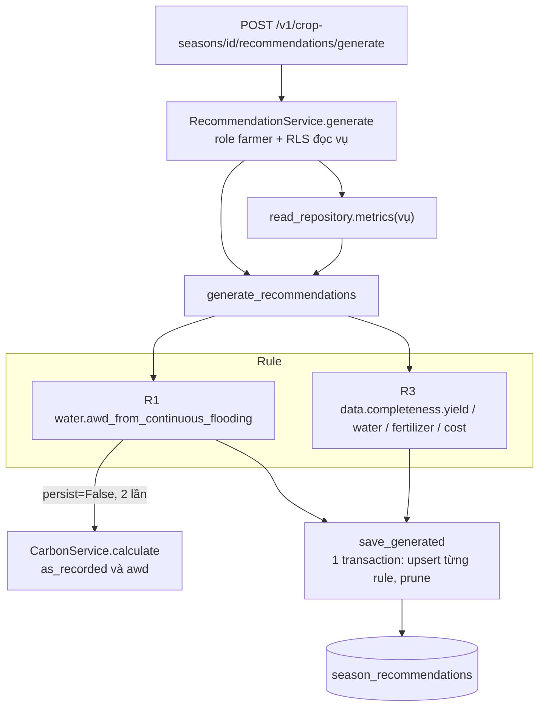
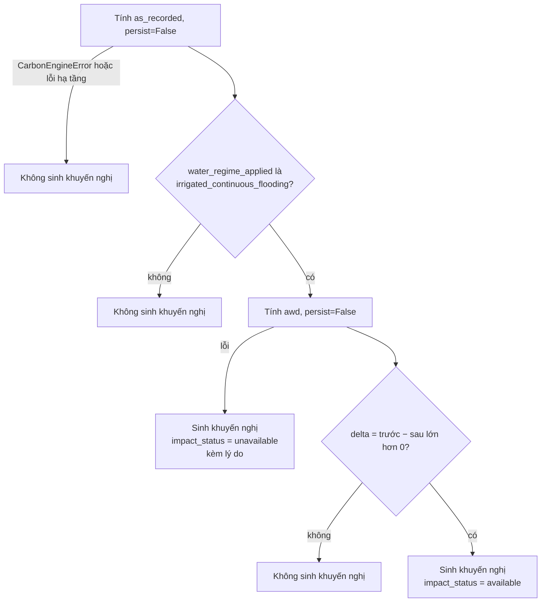

# Recommendation

Khuyến nghị canh tác **xác định (deterministic)** sinh bằng rule, không dùng mô hình
học máy. Mỗi khuyến nghị có định lượng đều lấy bằng chứng từ **chính Carbon Engine**;
module này không có công thức CH₄/N₂O riêng.

| Thành phần | File |
|---|---|
| Rule | `backend/recommendation/rules.py` |
| Điều phối | `backend/recommendation/engine.py` (`ENGINE_VERSION = "1"`) |
| Service | `backend/service.py::RecommendationService` |
| Repository | `backend/infrastructure/recommendation_repo.py` |
| Bảng | `season_recommendations` (migration `20260911120000`) |
| Farmer Web | `web-dashboard/src/api/recommendations.ts`, `src/farmer/Recommendations.tsx` |
| Flutter | Chưa nối (`UnavailableRecommendationRepository`) |

Test `backend/tests/test_recommendation_no_carbon_duplication.py` chặn việc đưa định
danh phương pháp luận Carbon vào package recommendation.

## Luồng sinh khuyến nghị



## R1 — Gợi ý AWD

`rule_code = water.awd_from_continuous_flooding`, `rule_version = 1`, `type = optimization`.



Khi `available`:

```text
co2e_total_kg_before = total_co2e_kg (as_recorded)
co2e_total_kg_after  = total_co2e_kg (awd)
co2e_total_kg_delta  = before − after
co2e_percent_delta   = delta / before     (null nếu before = 0)
```

`evidence` lưu `baseline_input_hash`, `proposed_input_hash`, hai chế độ nước và
`ef_config_version`; `input_hash` của khuyến nghị là `input_hash` của kịch bản nền.

**Không có tỷ lệ phần trăm cố định cho AWD.** Kịch bản `awd` được Carbon Engine chạy
lại trên cùng dữ liệu vụ: `SFw` của CH₄ giảm (1,00 → 0,55) và `EF1FR` của N₂O tăng
(0,003 → 0,005) trong cùng một lần tính
(xem [Phương pháp tính](../methodology/carbon-calculation.md#7-awd-khong-phai-mot-ty-le-giam-co-inh)).
Khuyến nghị chỉ xuất hiện khi chênh lệch **ròng** dương.

!!! note "Trạng thái thực tế"
    Vì GWP chưa có giá trị, bước tính `as_recorded` luôn ném `MissingEmissionFactorError`,
    nên R1 **không sinh khuyến nghị nào** cho vụ thật ở thời điểm hiện tại. Đây là hành
    vi đúng thiết kế: không có baseline thì không đưa ra gợi ý giả.

## R3 — Bổ sung dữ liệu

`rule_code = data.completeness.<key>`, `type = data_task`, luôn
`impact_status = unavailable` với lý do "Đây là gợi ý bổ sung dữ liệu, không phải
khuyến nghị tối ưu hoá có định lượng."

| `key` | Điều kiện sinh | Tiêu đề |
|---|---|---|
| `yield` | `metrics.yield_kg` là `null` | Ghi sản lượng thu hoạch |
| `water` | `data_completeness.water` là `false` | Bổ sung lượng nước tưới |
| `fertilizer` | `data_completeness.fertilizer` là `false` | Bổ sung khối lượng phân bón |
| `cost` | `data_completeness.cost` là `false` | Bổ sung chi phí vật tư |

`input_hash = sha256("<crop_season_id>:<key>")`.

## Khi tác động không tính được

- Trường `impact_status = "unavailable"` kèm `impact_unavailable_reason`.
- Các cột `co2e_total_kg_before/after/delta` và `co2e_percent_delta` là `null`, không phải 0.
- Farmer Web hiển thị "Chưa có khuyến nghị định lượng" khi không có khuyến nghị
  tối ưu hoá.

## Không có benchmark giả

Không rule nào so sánh với trung bình HTX, benchmark vùng hay giá tín chỉ carbon.
Các bảng baseline `benchmark_snapshots`, `recommendation_rules`, `recommendations`
không được dùng; `reference_values` và `carbon_credit_price` trong YAML không được
engine đọc.

## Lưu và vòng đời

| Hành vi | Code |
|---|---|
| Một hàng cho mỗi `(crop_season_id, rule_code)` | Unique constraint; upsert `on conflict ... do update` |
| Sinh lại **giữ nguyên** quyết định của nông hộ | Upsert chỉ cập nhật nội dung/bằng chứng và `generated_at`, không đụng `status`, `accepted_at`, `dismissed_at` |
| Rule không còn áp dụng | Hàng `status = generated` của rule đó bị xoá (`_prune`); hàng đã `accepted`/`dismissed` được giữ |
| Chấp nhận / bỏ qua | `PATCH /v1/recommendations/{id}` với `status` ∈ `accepted`, `dismissed` (role `farmer` + RLS đọc vụ) |
| Đọc | `GET /v1/crop-seasons/{id}/recommendations` qua RLS, sắp theo `generated_at` |

Farmer Web không sinh khuyến nghị mỗi lần mở trang: trang đọc bản đã lưu; việc sinh
lại chạy khi người dùng bấm "Cập nhật khuyến nghị" hoặc chạy nền khi dữ liệu đã cũ.
