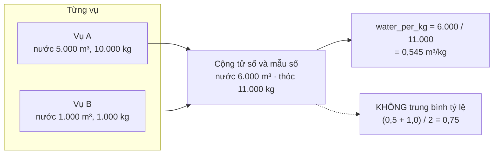

# Resource Metrics

Chỉ số hiệu quả tài nguyên trên mỗi kg thóc, tính **tại thời điểm đọc** trong
`backend/infrastructure/read_repo.py` (không có service riêng và không lưu snapshot).
Bảng baseline `resource_metric_snapshots` tồn tại nhưng không được dùng.

## Chỉ số của một vụ

`GET /v1/crop-seasons/{id}/metrics` → `SupabaseReadRepository.metrics()` →
`_compute_metric_totals(activities, carbon_rows)`.

| Trường | Tử số | Mẫu số | Đơn vị |
|---|---|---|---|
| `yield_kg` | Σ `harvest_events.yield_kg` | — | kg |
| `water_m3` / `water_per_kg` | Σ `irrigation_events.water_volume_m3` | `yield_kg` | m³ / m³ trên kg |
| `fertilizer_kg` / `fertilizer_per_kg` | Σ `fertilizer_applications.amount_kg` (khối lượng **phân vật lý**, không phải kg N) | `yield_kg` | kg / kg trên kg |
| `cost_per_kg` | Σ chi phí **ghi trực tiếp** trên từng activity | `yield_kg` | VND trên kg |
| `total_co2e_kg` / `co2e_per_kg` | `total_co2e_kg` của bản tính `succeeded` mới nhất có `scenario = actual` | `yield_kg` của metrics | kg CO₂e / kg CO₂e trên kg |

Cột chi phí theo loại activity:

| Loại | Cột |
|---|---|
| `seeding` | `cost_vnd` |
| `fertilizer`, `irrigation`, `pesticide`, `fuel`, `straw_management`, `harvest` | `total_cost_vnd` |

Chi phí nhân công và thuê máy **không** có trường riêng và không được suy ra.

`data_completeness = {water, fertilizer, cost, carbon}` cho biết từng nhóm có đủ dữ
liệu hay không.

## `null` không phải `0`

| Tình huống | Kết quả |
|---|---|
| Không có bản ghi thu hoạch (hoặc tổng bằng 0) | `yield_kg = null` → mọi chỉ số trên kg là `null` |
| Không có bản ghi tưới | `water_m3 = null`, `water_per_kg = null`, `completeness.water = false` |
| Không có bản ghi phân bón | `fertilizer_kg = null`, `completeness.fertilizer = false` |
| Có activity thiếu cột chi phí (kể cả loại không có cột chi phí) | `cost_per_kg = null`, `completeness.cost = false` |
| Chưa có bản tính Carbon thành công, scenario `actual` | `total_co2e_kg = null`, `co2e_per_kg = null`, `completeness.carbon = false` |

Giao diện hiển thị "—" hoặc trạng thái "chưa đủ dữ liệu" thay vì số 0.

## Tổng hợp theo farm và tổ chức



`_aggregate_from_totals` dùng cho `GET /v1/farms/{id}/metrics`,
`GET /v1/organizations/{id}/metrics` và cột chỉ số của farm performance:

```text
total(field) = Σ field của mọi vụ,  nhưng = null nếu BẤT KỲ vụ nào có field = null
water_per_kg = total(water_m3) / total(yield_kg)
fertilizer_per_kg = total(fertilizer_kg) / total(yield_kg)
co2e_per_kg = total(total_co2e_kg) / total(yield_kg)
cost_per_kg = total(chi phí) / total(yield_kg)
```

Hệ quả: một vụ thiếu dữ liệu làm chỉ số tổng của cả nhóm thành `null` — hệ thống
không lặng lẽ bỏ qua vụ chưa đo.

| Endpoint | Nội dung |
|---|---|
| `GET /v1/organizations/{id}/summary` | `farm_count`, `plot_count`, `crop_season_count`, `total_area_ha`; `total_yield_kg`/`total_co2e_kg`/`co2e_per_kg` chỉ có khi **mọi** vụ có cả sản lượng và CO₂e |
| `GET /v1/organizations/{id}/farm-performance` | Mỗi farm: diện tích, sản lượng, 4 chỉ số trên kg, `data_status` |
| `GET /v1/farms/{id}/metrics`, `GET /v1/organizations/{id}/metrics` | Cùng hình dạng `MetricResponse` |

`data_status`: `complete` khi mọi vụ của farm đủ cả 4 nhóm; `partial` khi có vụ
nhưng thiếu; `missing` khi farm không có vụ nào.

Các route tổng hợp đọc hàng loạt bằng `IN (...)` (`_bulk_metric_totals`) nên số
request không tăng theo số vụ.

## Nơi dùng lại

| Nơi | Cách dùng |
|---|---|
| Recommendation | `evaluate_data_completeness` đọc `yield_kg` và `data_completeness` |
| MRV manifest | `metrics_for_seasons` → cùng `_bulk_metric_totals`, số lượng xuất ra dạng chuỗi thập phân |
| Farmer Web | `farmer/metricsView.ts`, trang Hiệu suất |
| Management Web | `pages/performance.tsx`, `components/FarmPerformanceTable.tsx`, tab hiệu suất của vụ |
| Flutter | `screens/resource_dashboard_screen.dart` |

## Vấn đề đã biết {#van-de-da-biet}

!!! bug "Cờ đầy đủ của nước và phân bón phụ thuộc bản ghi cuối"
    Trong `_compute_metric_totals`, `has_water` được gán `True` ở **mỗi** bản ghi tưới
    rồi mới gán `False` nếu bản ghi đó thiếu `water_volume_m3` (tương tự
    `has_fertilizer` với `amount_kg`). Vì vậy giá trị cuối cùng chỉ phản ánh bản ghi
    được duyệt **sau cùng**: nếu một bản ghi thiếu lượng nước đứng trước một bản ghi
    có số, `completeness.water` vẫn là `true` và `water_per_kg` được tính từ tổng
    thiếu. Thứ tự bản ghi phụ thuộc thứ tự trả về của truy vấn.
    Test hiện có (`backend/tests/test_read_repository.py`) chỉ phủ trường hợp bản
    ghi thiếu đứng cuối. Trong thực tế, `fertilizer_applications.amount_kg` là
    `NOT NULL` ở DB nên phần phân bón khó xảy ra; phần nước (`water_volume_m3`
    nullable) thì có thể. Được phát hiện trong audit tài liệu, **chưa sửa**.
