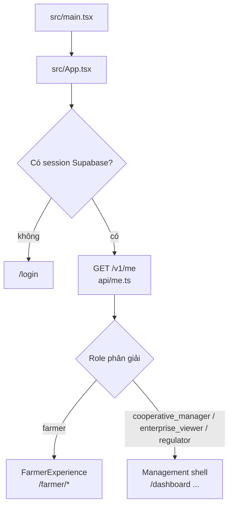

# Web: Farmer & Management

`web-dashboard/` là **một** ứng dụng React 19 + Vite 7 + TypeScript. Sau khi đăng
nhập, ứng dụng dựng một trong hai shell dựa trên role lấy từ `GET /v1/me`.

## Điểm vào và định tuyến

- Role được chọn theo thứ tự `cooperative_manager` → `enterprise_viewer` → `regulator` →
  `farmer`; không khớp gì thì mặc định `farmer` (`api/me.ts`).
- Một "viewer hint" lưu trong `localStorage` theo đúng Supabase user id giúp vẽ đúng
  shell ngay khi tải lại trang; mọi dữ liệu vẫn được uỷ quyền bằng JWT + RLS.
- Định tuyến tự viết (`routes.ts`, `ui.tsx::go/Link`), không dùng thư viện router.

!!! note "Role `enterprise_viewer`"
    Web dùng đúng giá trị role của backend (`enterprise_viewer`), đưa tài khoản doanh nghiệp
    vào Management shell chỉ đọc (sửa [B2](../limitations/implementation-audit-findings.md#b2)
    ngày 2026-09-15). Nút "Tính lại" Carbon và nút xuất MRV không hiện với role chỉ đọc.

## Farmer shell (`src/farmer/`)

| Route | Trang |
|---|---|
| `/farmer` | Tổng quan: vụ đang canh tác, Ghi nhanh, Hiệu suất vụ này, Nhật ký gần đây, Cần chú ý, khuyến nghị, kiểm tra lá lúa |
| `/farmer/journal` | Nhật ký canh tác (chọn vụ) |
| `/farmer/farms`, `/farmer/farms/{id}`, `/farmer/plots/{id}` | Ruộng của tôi → nông hộ → thửa |
| `/farmer/crop-seasons/{id}` | Không gian vụ: tab Tổng quan · Nhật ký · Hiệu suất · Carbon |
| `/farmer/performance` | Hiệu suất vụ của tôi |
| `/farmer/account` | Tài khoản, phạm vi truy cập, đăng xuất |

API dùng: `/v1/farmer/scope`, `/v1/crop-seasons/{id}` (+ `/activities`, `/metrics`,
`/carbon`, `/production-batches`, `/recommendations`, `/recommendations/generate`,
`/cv/infer`, `/cv/inferences`), `/v1/activities/{id}`, `/v1/recommendations/{id}`.

Lớp dữ liệu Farmer (`farmer/data.ts`, `farmer/scope.ts`) có cache đọc theo phiên,
gộp request trùng đang bay và prefetch phạm vi; cache bị xoá khi đăng xuất.

## Management shell (`src/pages/`, `src/features/`)

| Nhóm | Route | Trang |
|---|---|---|
| Tổng quan | `/dashboard` | KPI tổ chức, hiệu suất theo nông hộ, hiệu suất vùng, Carbon, MRV, Cần chú ý |
| Quản lý | `/organizations`, `/farms`, `/farms/{id}`, `/plots/{id}` | Danh bạ tổ chức, nông hộ, thửa |
| Quản lý | `/crop-seasons/{id}` (+ `/activities`, `/performance`, `/carbon`, `/mrv`) | Hub vụ: Tổng quan · Hoạt động · Hiệu suất · Carbon · MRV |
| Hiệu suất | `/performance` | Hiệu suất vùng, so sánh nông hộ |
| MRV | `/mrv` | Hồ sơ MRV, tiến trình 6 bước, xuất PDF/XLSX/JSON, lịch sử xuất |

Management Web **chỉ đọc** dữ liệu canh tác; hai thao tác ghi duy nhất là tính lại
Carbon (`POST /v1/carbon/calculate`) và tạo gói xuất MRV. Nút xuất MRV chỉ hiện với
`cooperative_manager`.

## Giao tiếp với backend

- `src/utils/supabase.ts` tạo client Supabase **chỉ cho auth**.
- `src/api/client.ts::apiRequest` gửi `Authorization: Bearer <JWT>` tới
  `VITE_API_BASE_URL`, parse envelope lỗi `{detail: {error: {code, message}}}` thành
  `ApiError`; `apiBlob` dùng cho tải tệp XLSX/PDF/JSON.
- Không có công thức Carbon hay chỉ số trong frontend; giao diện chỉ định dạng giá
  trị (`src/format.ts`) và hiển thị trạng thái thiếu dữ liệu.
- `VITE_USE_MOCK_DATA=true` bật dữ liệu giả từ `src/mocks/data.ts` (có nhãn "MOCK
  DATA"), dùng cho demo UI và Playwright mock.

## Test

| Loại | File |
|---|---|
| Vitest (unit, một số DOM) | `src/**/*.test.ts(x)` |
| Playwright mock | `tests/e2e/web-smoke.spec.ts`, `tests/e2e/farmer-web.spec.ts` |
| Playwright dữ liệu thật (gated) | `tests/e2e/web-real-data.spec.ts`, `farmer-real-*.spec.ts` với `playwright.real.config.ts` |
