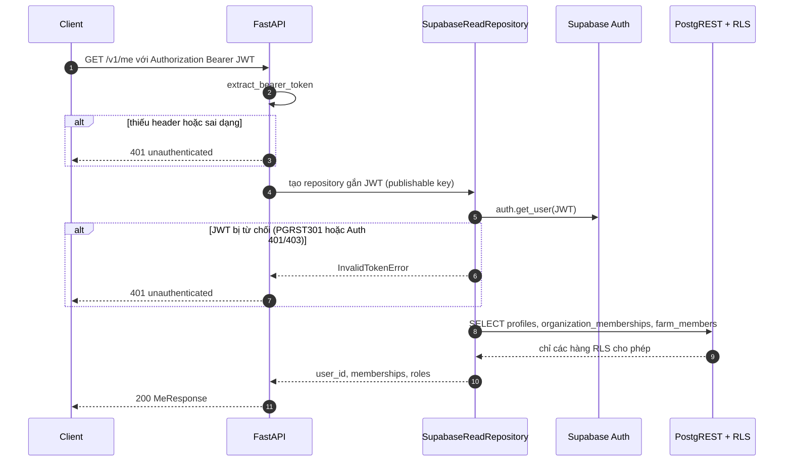

# Authentication và RLS

Phân quyền của AgriCarbon có hai lớp:

1. **PostgreSQL Row Level Security (RLS)** — ranh giới tenant thật, áp cho mọi truy
   cập bằng JWT người dùng (Flutter trực tiếp, và backend khi đọc thay người gọi).
2. **Kiểm tra bổ sung ở FastAPI** — theo thiết kế chỉ *thu hẹp thêm* trên nền RLS
   (ví dụ bắt buộc role `farmer` để ghi qua web, `cooperative_manager` để xuất MRV).

!!! bug "Ngoại lệ còn mở: `POST /v1/carbon/calculate`"
    Backend ghi bằng kết nối bỏ qua RLS **sau** một bước kiểm tra đọc, nên nếu bước
    kiểm tra lỏng hơn policy ghi thì quyền thực tế bị nới rộng. Còn một trường hợp chưa
    sửa: route này lưu bản tính cho bất kỳ ai đọc được vụ
    ([B4](../limitations/implementation-audit-findings.md#b4)).

    Đã sửa ngày 2026-09-15: ghi activity qua Farmer Web nay kiểm đúng helper ghi của RLS
    ([B3](../limitations/implementation-audit-findings.md#b3)); `/v1/me` chỉ tính membership
    còn hiệu lực ([B7](../limitations/implementation-audit-findings.md#b7)); client không còn
    quyền nào trên bucket `mrv-exports` ([M7](../limitations/implementation-audit-findings.md#m7)).

## Supabase Auth và JWT

| Client | Đăng nhập | Token được dùng thế nào |
|---|---|---|
| Web | `supabase.auth.signInWithPassword` (`web-dashboard/src/api/auth.ts`) | `access_token` được đặt vào `api/client.ts` và gửi `Authorization: Bearer <JWT>` tới FastAPI. Không gọi PostgREST trực tiếp |
| Flutter | `supabase_flutter` (`app/lib/services/auth_service.dart`) | Client Supabase tự gắn JWT cho PostgREST; `http` gửi Bearer JWT tới FastAPI |

Không có luồng đăng ký trong ứng dụng; tài khoản QA/demo được tạo bằng script
(`backend/scripts/create_farmer_qa_identity.py`, `seed_demo_data.py`).

## FastAPI xác thực người gọi thế nào

Chi tiết đọc từ code:

- `extract_bearer_token` yêu cầu đúng dạng `Bearer <token>`.
- Client Supabase cho mỗi token được cache theo **đúng chuỗi token**
  (`infrastructure/supabase_clients.py`, tối đa 32 client, TTL 600 giây), nên
  một client không bao giờ trả lời cho người gọi khác.
- `jwt_rejection_as_invalid_token` chỉ đổi lỗi xác thực thật thành 401; lỗi mạng
  hay Supabase sập vẫn là 5xx.
- `roles` trong `/v1/me` là **hợp** của `organization_memberships.role` và
  `farm_members.farm_role`, nên có thể chứa `farmer`, `cooperative_manager`,
  `enterprise_viewer`, `regulator`, `owner`, `editor`, `viewer`.
  Chỉ membership còn hiệu lực (`ended_at` null hoặc ở tương lai) được tính — cùng quy tắc
  với helper RLS, trong `infrastructure/memberships.py` (sửa B7).
- Riêng hai route Carbon trả `401 missing_authorization` khi thiếu header; các route
  khác trả `401 unauthenticated`.

## Hàm RLS (`private.*`, security definer)

| Hàm | Trả `true` khi |
|---|---|
| `user_is_org_member(org)` | Có membership còn hiệu lực trong tổ chức (bất kỳ role) |
| `user_is_org_manager(org)` | Membership còn hiệu lực với role `cooperative_manager` |
| `user_can_read_organization(org)` | Là thành viên, **hoặc** là `enterprise_viewer`/`regulator` của tổ chức được cấp `organization_data_grants` còn hạn |
| `user_can_read_farm(farm)` | Có dòng `farm_members` (bất kỳ `farm_role`), **hoặc** là manager của HTX sở hữu farm, **hoặc** là `enterprise_viewer`/`regulator` qua data grant còn hạn |
| `user_can_write_farm(farm)` | `farm_role` là `owner`/`editor`, **hoặc** là manager của HTX |
| `user_can_manage_farm_members(farm)` | `farm_role = owner` hoặc manager |
| `user_can_read_crop` / `user_can_write_crop` | Theo farm của thửa chứa vụ |
| `user_can_read_batch` / `user_can_write_batch` | Theo vụ chứa lô |
| `user_can_read_mrv_case(case)` | `user_can_read_organization` của tổ chức sở hữu case |
| `user_can_manage_mrv_case(case)` | `user_is_org_manager` của tổ chức sở hữu case |
| `user_can_delete_activity(activity)` | Người gọi là `recorded_by` **và** ghi được lô |

## Policy chính

| Bảng | SELECT | INSERT / UPDATE |
|---|---|---|
| `profiles` | Chính mình hoặc cùng tổ chức | UPDATE chính mình |
| `organizations`, `organization_memberships` | `user_can_read_organization` / thành viên | — |
| `farms`, `plots` | `user_can_read_farm` (chưa xoá) | `plots`: `user_can_write_farm`; `farms` INSERT: thành viên role `farmer`/`cooperative_manager` của HTX |
| `crop_seasons`, `production_batches` | Đọc theo farm/vụ (chưa xoá) | Ghi theo `user_can_write_crop` / `user_can_write_batch` |
| `activities` | `user_can_read_batch` **và** `deleted_at is null` | INSERT: ghi được lô và `recorded_by` là null hoặc chính mình; UPDATE: như trên, không đổi chủ |
| Bảng chi tiết activity | Theo activity cha | Ghi được lô của activity cha (kể cả DELETE) |
| `devices` | Của chính mình | Của chính mình |
| `emission_factor_sets`, `emission_factors` | Chỉ bộ `published` | — |
| `carbon_calculations`, `carbon_breakdowns` | `user_can_read_crop(crop_season_id)` (và policy cũ theo batch) | Không có — chỉ backend ghi |
| `season_recommendations` | `user_can_read_crop` | Không có — chỉ backend ghi |
| `plant_images` | `user_can_read_crop` | INSERT: ghi được vụ và `uploaded_by` là chính mình |
| `cv_inferences` | Theo ảnh | Không có — chỉ backend ghi |
| `cv_model_versions` | `status` là `active`/`retired` | — |
| `mrv_cases`, `mrv_case_steps`, `mrv_case_batches`, `mrv_evidence` | `user_can_read_organization` / `user_can_read_mrv_case` | Chỉ manager của tổ chức |
| `mrv_exports`, `mrv_export_calculations` | **`user_can_manage_mrv_case`** (siết từ migration `20260913150000`) | Không có — chỉ backend ghi |

`public.soft_delete_activity(uuid)` là RPC security definer để Flutter xoá mềm:
PostgreSQL áp policy SELECT lên cả hàng mới của UPDATE, mà `activities_select` yêu
cầu `deleted_at is null`, nên client không thể tự `update ... set deleted_at`.

## Ma trận quyền theo role

!!! info "Cách đọc"
    "Farmer" ở đây là người có `organization_role = farmer` **và** dòng `farm_members`
    cho farm của mình. Riêng role tổ chức `farmer` không cấp quyền đọc farm; quyền đọc
    farm đến từ `farm_members`.

| Khả năng | Farmer | Cooperative Manager | Enterprise Viewer | Regulator |
|---|---|---|---|---|
| Đọc farm / plot / vụ / activity | Farm mình là thành viên | Mọi farm của HTX mình quản lý | Farm của tổ chức nguồn có data grant còn hạn | Như Enterprise Viewer |
| Đọc Carbon, metrics, khuyến nghị, CV của vụ | Theo quyền đọc vụ | Theo quyền đọc vụ | Theo quyền đọc vụ | Theo quyền đọc vụ |
| Ghi activity qua **Flutter** (RLS) | `farm_role` `owner`/`editor` | Có (manager ghi được farm HTX) | Không | Không |
| Ghi activity qua **Farmer Web** (FastAPI) | `farm_role` `owner`/`editor` (cùng quy tắc RLS) | Không (thiếu role `farmer`) | Không | Không |
| Generate / chấp nhận khuyến nghị | Có | Không | Không | Không |
| Upload ảnh CV (`POST .../cv/infer`) | Có | Không | Không | Không |
| Xem kết quả CV đã lưu | Có | Có | Có | Có |
| Gọi `POST /v1/carbon/calculate` | Có | Có | Có | Có |
| Đọc hồ sơ MRV (case, bước, lô, bằng chứng) | Có nếu là thành viên tổ chức | Có | Có qua data grant | Có qua data grant |
| Tạo / sửa MRV case, step, evidence | Không | Có (qua DB/RLS; **không có API**) | Không | Không |
| Tạo gói xuất MRV JSON/XLSX/PDF | Không (404) | **Có** — tổ chức của mình | Không (404) | Không (404) |
| Xem lịch sử / tải gói xuất MRV | Không | **Có** — tổ chức của mình | Không | Không |

Ghi chú đối chiếu code:

- **Carbon calculate:** `api.py::_require_caller` chỉ yêu cầu JWT hợp lệ và đọc được
  crop season qua RLS; không kiểm role. Bản tính được lưu bằng service role.
- **Ghi activity qua Farmer Web:** `ActivityWriteService` yêu cầu `"farmer"` có trong
  `roles`, đọc được vụ qua RLS, vụ ở trạng thái `active`, vụ có đúng một lô chưa
  `closed`/`cancelled`; sửa/xoá chỉ áp cho activity do chính người gọi ghi
  (`recorded_by = actor`). Repository ghi còn gọi `private.user_can_write_batch` trong
  chính transaction ghi — cùng helper với RLS của Flutter — nên `viewer` bị từ chối
  `404` (sửa B3).
- **Khuyến nghị và CV:** `RecommendationService.generate/set_status` và
  `CvService.infer` yêu cầu role `farmer` + đọc được vụ. `CvService.list/get` chỉ
  yêu cầu đọc được vụ.
- **MRV export:** `MrvExportService._manages` tái hiện `private.user_is_org_manager`
  (role `cooperative_manager`, `ended_at` null hoặc ở tương lai) trên tổ chức sở hữu
  case, **sau khi** case đã đọc được qua RLS. Download và render lọc `mrv_case_id`
  theo danh sách case người gọi quản lý ngay trong SQL.
- **Web UI:** nút xuất MRV chỉ hiện khi role phân giải là `cooperative_manager`
  (`pages/mrv.tsx`); đây chỉ là tiện ích giao diện, server vẫn từ chối.

## Mã lỗi phân quyền

| Tình huống | HTTP | `code` |
|---|---|---|
| Thiếu / sai header Authorization | 401 | `unauthenticated` (Carbon: `missing_authorization`) |
| JWT hết hạn / chữ ký sai | 401 | `unauthenticated` |
| Không có quyền **hoặc** không tồn tại | 404 | `not_found` / `crop_not_found` |
| Vụ không mở cho ghi | 422 | `invalid_crop_season_state` |
| Trùng idempotency key khác dữ liệu | 409 | `duplicate_event` |

Mọi lỗi dùng một envelope: `{"detail": {"error": {"code": "...", "message": "..."}}}`.

## Service role và bí mật

- `SUPABASE_SERVICE_ROLE_KEY` và `SUPABASE_DB_URL` chỉ tồn tại ở backend; kết nối
  này bỏ qua RLS và chỉ được dùng **sau** bước kiểm tra bằng JWT người gọi.
- Repository ghi không bao giờ nhận `actor`, `organization` hay `role` từ payload
  HTTP — actor lấy từ `/v1/me` của chính JWT.
- CORS chỉ cho các origin trong `AGRICARBON_CORS_ORIGINS`, method
  `GET/POST/PATCH/DELETE`, header `Authorization`/`Content-Type`.
- Response gói xuất MRV không chứa `storage_bucket`/`storage_object_path`; không có
  signed URL. Từ migration `20260915100000`, `storage.objects` không có policy client
  nào cho bucket `mrv-exports`: mọi thao tác list/tải/upload/xoá từ client bị từ chối, chỉ
  backend (service role) đọc/ghi artifact
  ([M7](../limitations/implementation-audit-findings.md#m7), đã sửa).
- `AGENTS.md` ghi nhận lịch sử Git cũ còn chứa mật khẩu của **tài khoản demo** trước
  đây; tài khoản QA chỉ dùng cho demo, mật khẩu hiện truyền qua biến môi trường.
