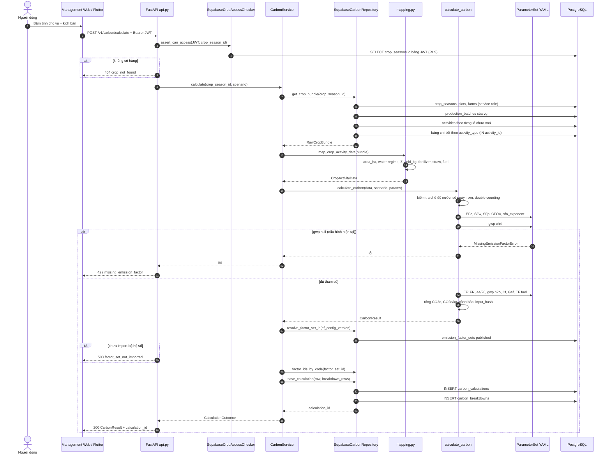
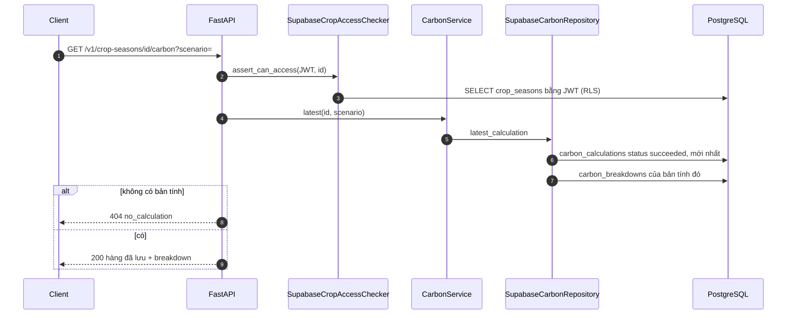

# Sequence: tính Carbon

Route thật: `POST /v1/carbon/calculate` với body
`{"crop_season_id": "<uuid>", "water_regime_scenario": "as_recorded" | "awd" | "continuous_flooding"}`.
Client gọi route này: Management Web (`features/carbon.tsx`, nút tính lại) và
Flutter (`screens/carbon_result_screen.dart`). Farmer Web chỉ đọc kết quả.

## Tính và lưu

Các nhánh kiểm tra dữ liệu (không hiện hết trong sơ đồ để giữ gọn) trả lỗi trước
khi tới bước hệ số:

| Kiểm tra | HTTP |
|---|---|
| Thửa thiếu `area_ha` | 422 `missing_activity_data` |
| Tưới `alternate`/`other` không có `ipcc_water_regime` | 422 `methodology_gap` |
| Nhiều chế độ tưới mâu thuẫn | 409 `conflicting_water_records` |
| `as_recorded` nhưng không có chế độ nước | 422 `missing_activity_data` |
| Thiếu số ngày canh tác | 422 `missing_activity_data` |
| Rơm vùi thiếu `days_before_cultivation` / thiếu `dry_matter_fraction` | 422 `methodology_gap` |
| Thiếu `pre_season_water_regime` | 422 `methodology_gap` |

## Đọc bản tính đã lưu

## Chạy giả định không lưu (`persist=False`)

`RecommendationService` gọi `CarbonService.calculate(crop_season_id, scenario, persist=False)`:
toàn bộ bước nạp dữ liệu và tính giống hệt sơ đồ đầu, nhưng dừng sau khi có
`CarbonResult` — không resolve bộ hệ số, không ghi bảng nào. Xem
[sequence Recommendation](system-sequences.md#5-recommendation-simulation).
