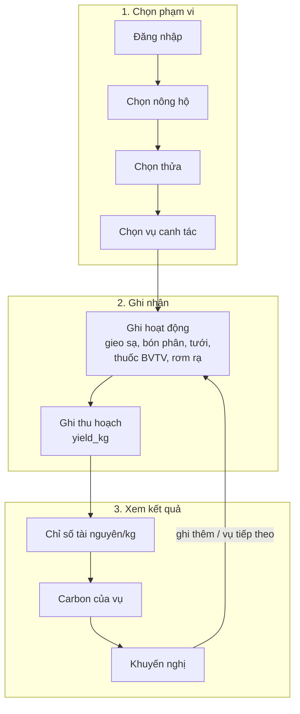
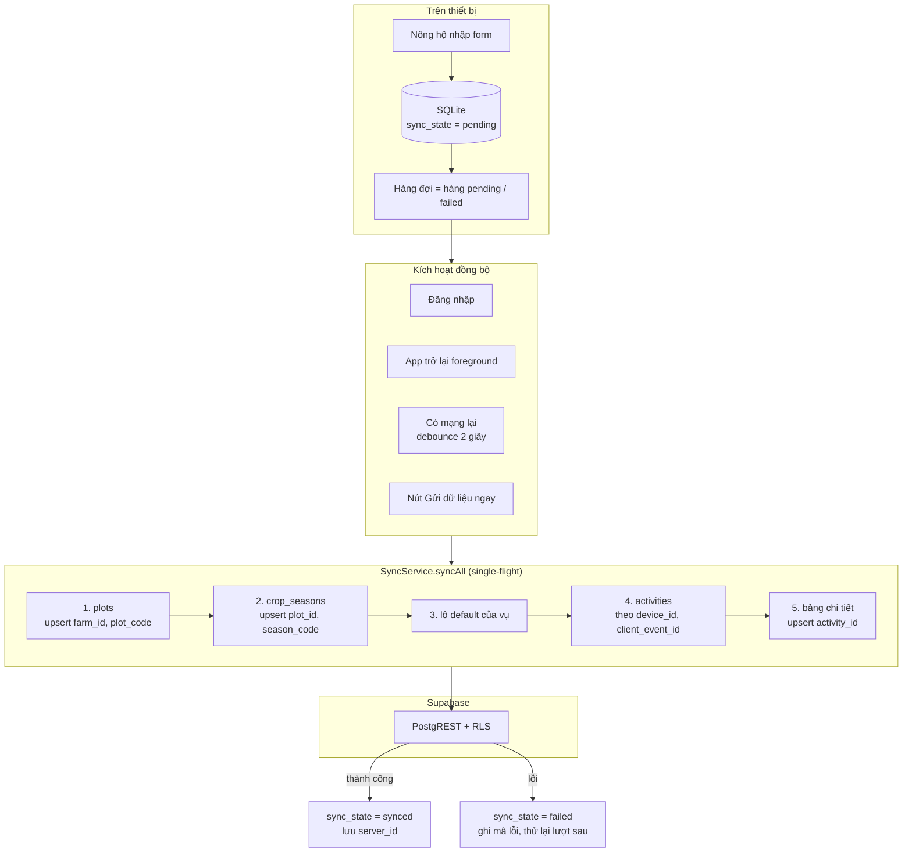
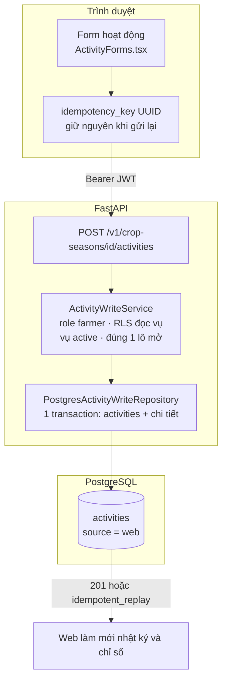

# Luồng nông hộ

Nông hộ đi qua cùng một vòng dữ liệu trên hai ứng dụng, nhưng **cách dữ liệu đi
tới server khác nhau**: Flutter ghi offline rồi đồng bộ thẳng vào Supabase; Farmer
Web ghi trực tuyến qua FastAPI.

## Vòng làm việc chung

Khả năng thực tế theo từng ứng dụng:

| Bước | Flutter Mobile | Farmer Web |
|---|---|---|
| Đăng nhập | Supabase Auth | Supabase Auth |
| Farm / thửa / vụ | Kéo farm/thửa/vụ về SQLite; **tạo được thửa và vụ** (upsert lên Supabase) | Chỉ đọc (`GET /v1/farmer/scope`) |
| Ghi hoạt động | 7 loại, gồm `fuel`; offline được | 6 loại (không có `fuel`); cần mạng; vụ phải `active` và có đúng một lô mở |
| Sửa / xoá | Có; xoá bản đã đồng bộ bằng RPC `soft_delete_activity` | Có; chỉ bản do chính mình ghi |
| Chỉ số tài nguyên | `GET /v1/crop-seasons/{id}/metrics` | `GET /v1/crop-seasons/{id}/metrics` |
| Carbon | Xem và **gọi tính** (`POST /v1/carbon/calculate`) | **Chỉ xem** bản tính đã lưu |
| Khuyến nghị | Chưa nối (màn hình báo "chưa cấu hình") | Xem, cập nhật, chấp nhận / bỏ qua |
| Kiểm tra lá lúa (CV) | Chưa nối (màn hình báo "chưa cấu hình") | Upload ảnh, xem lịch sử |

## Flutter: luồng offline

Chi tiết cài đặt: [Flutter Mobile](../modules/flutter-mobile.md).

## Farmer Web: luồng trực tuyến

Ngày hoạt động trên Farmer Web được gửi dưới dạng `YYYY-MM-DDT00:00:00Z`
(`farmer/ActivityForms.tsx`): form chỉ chọn **ngày**, không chọn giờ.

## Sau khi ghi dữ liệu

- **Chỉ số tài nguyên** tính lại ở lần đọc kế tiếp (không có snapshot).
- **Carbon không tự tính lại.** Bản tính đã lưu giữ nguyên cho tới khi có người gọi
  `POST /v1/carbon/calculate` (Management Web, Flutter). Với YAML hiện tại, lời gọi
  này dừng ở `422 missing_emission_factor`.
- **Khuyến nghị** chỉ sinh lại khi Farmer Web gọi
  `POST /v1/crop-seasons/{id}/recommendations/generate` (nút "Cập nhật khuyến nghị"
  hoặc làm mới nền khi dữ liệu cũ); lần mở trang chỉ đọc bản đã lưu.
