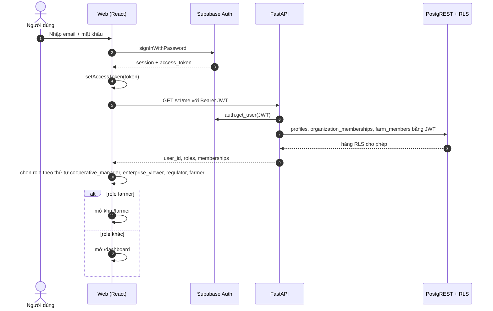
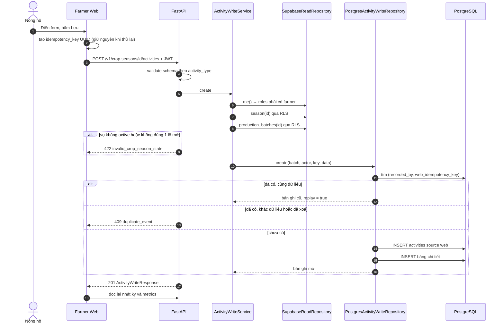
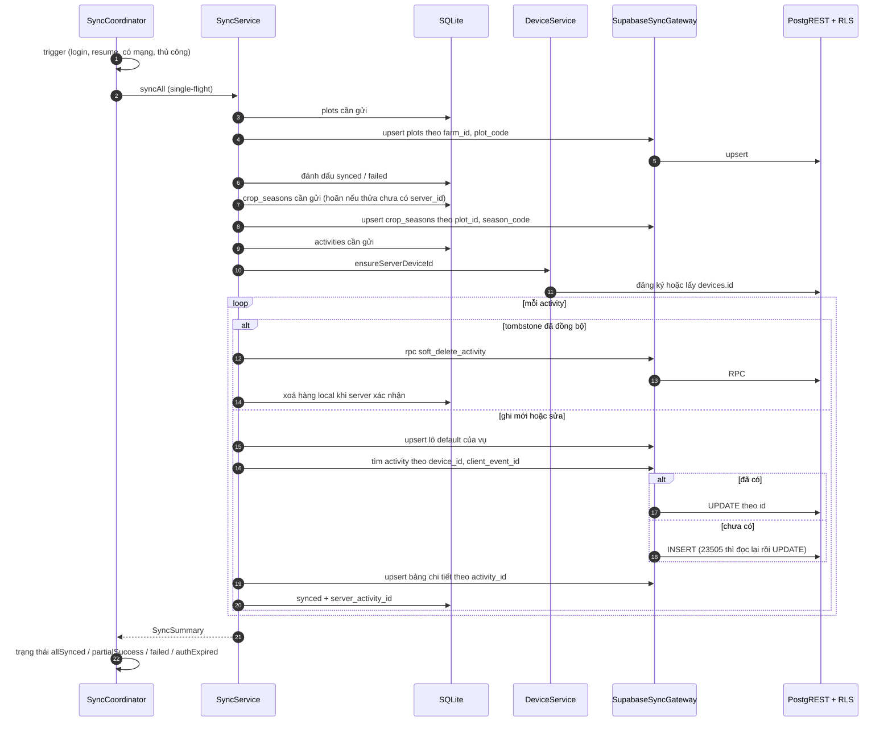
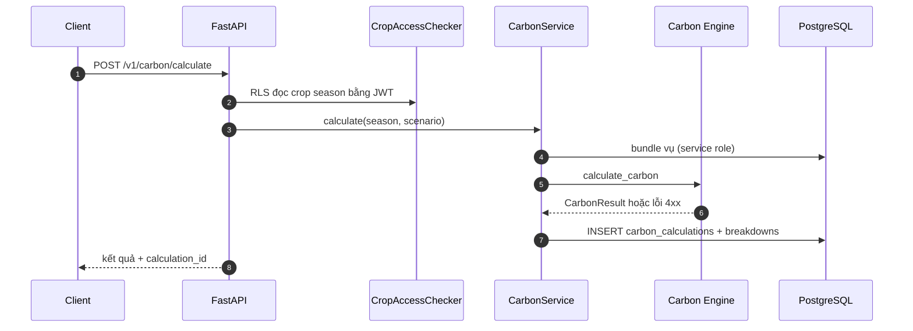
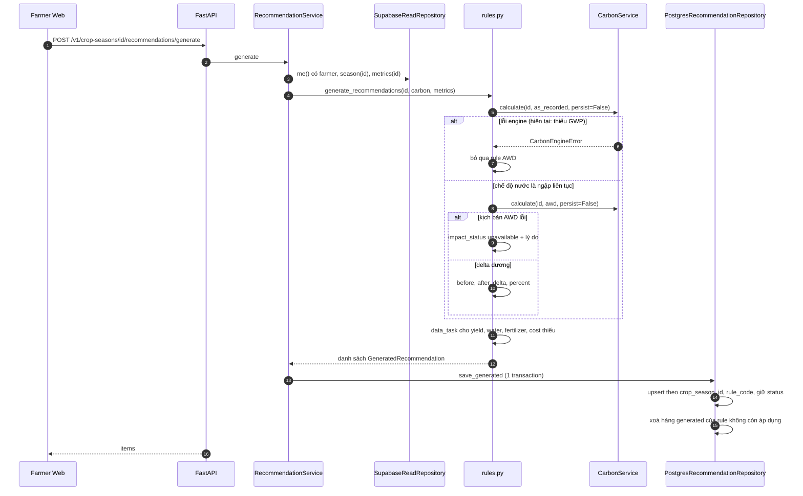
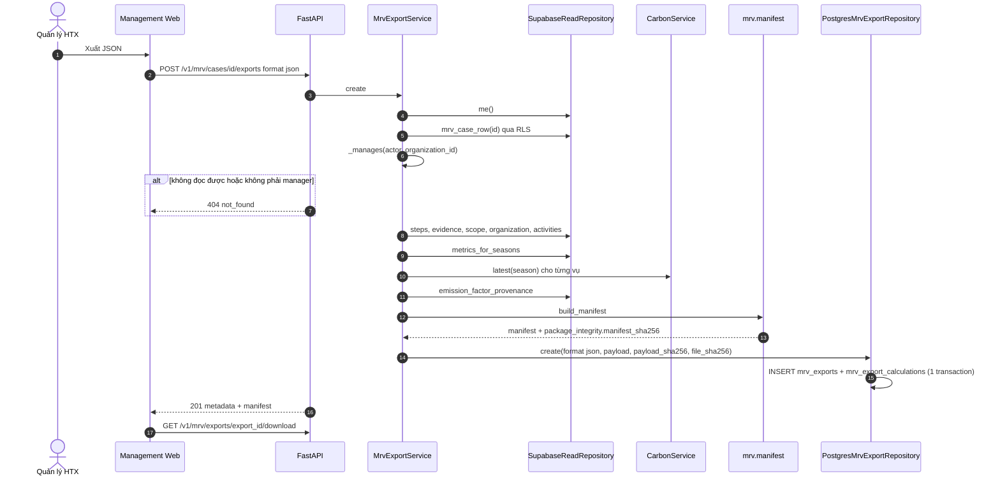
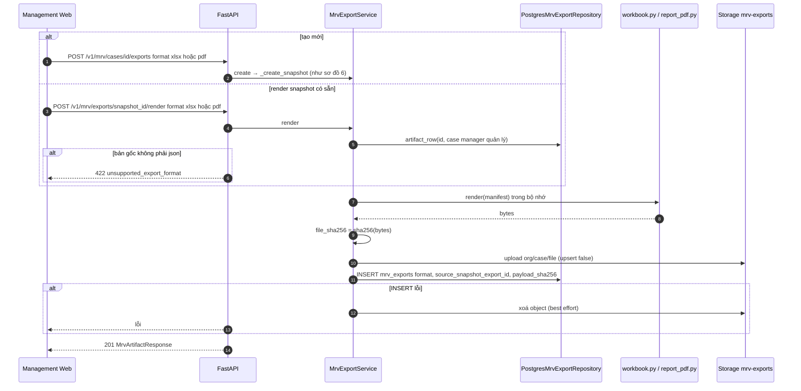
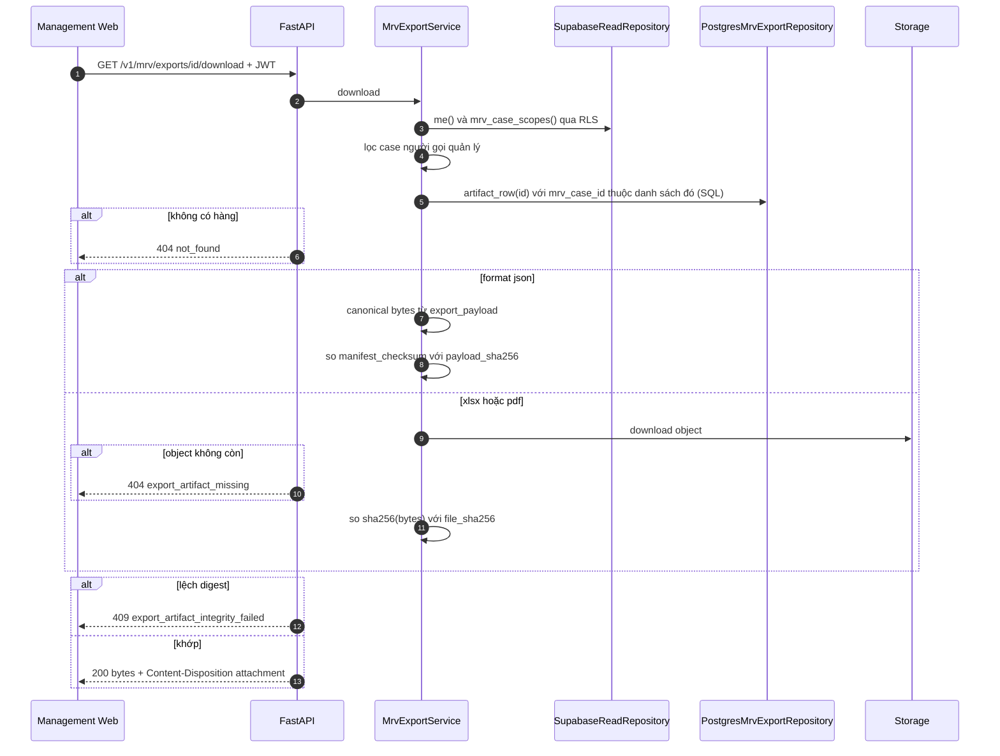

# Sequence diagram hệ thống

Tám sequence diagram dưới đây bám theo code hiện tại. Mỗi sơ đồ chỉ giữ các bước
quyết định hành vi; chi tiết lỗi nằm trong trang module tương ứng.

## 1. Login / auth

Flutter đăng nhập bằng `supabase_flutter`; client Supabase tự gắn JWT khi gọi
PostgREST, còn lời gọi FastAPI gắn Bearer JWT thủ công.

## 2. Farmer thêm activity qua Web

## 3. Flutter offline sync

## 4. Carbon calculation

Sơ đồ đầy đủ ở trang [Sequence tính Carbon](carbon-calculation-sequence.md). Tóm tắt:

## 5. Recommendation simulation

Không có bước nào ghi `carbon_calculations` trong luồng này.

## 6. MRV JSON export

## 7. XLSX / PDF render

## 8. Secure artifact download

